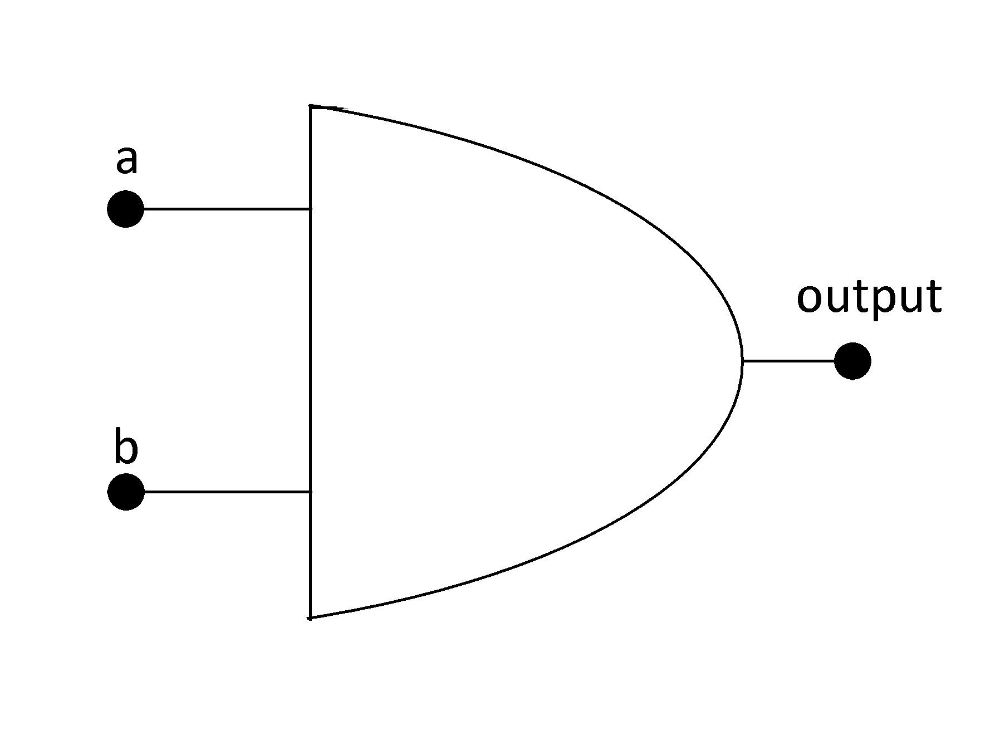
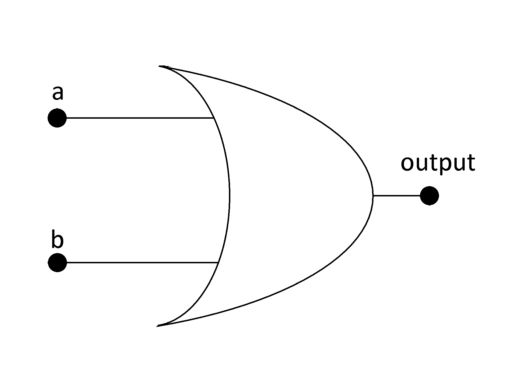
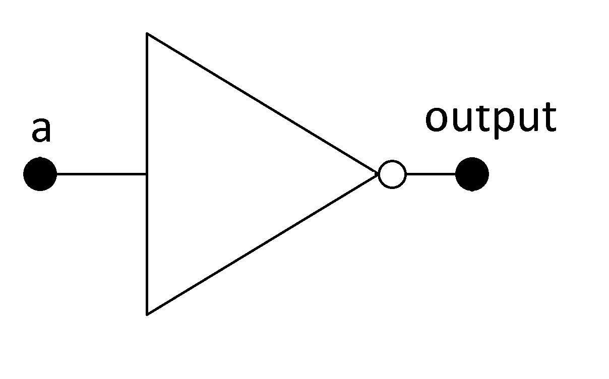

Boolean Algebra
###############

It is a branch of algebra where the values of the variables are 0 and 1, or false and true respectively. There are only three operations, the logical conjunction denoted as ∧ or X, logical disjunction denoted as ∨ or + and logical negation denoted as ¬ or !. In this text we will use X, + and ! respectively as the logic gates and, or and negation. 

Axioms of Boolean Algebra
=========================

From Wikipedia, *an axiom is a sentence or proposition that is not proven or demonstrated and is considered as obvious or as an initial consensus necessary for the construction or acceptance of a theory. For this reason, it is accepted as truth and serves as the starting point for deduction and inferences from other truths.* In Boolean algebra there are ten axioms and are described as follows. In these axioms “a” is a Boolean variable that can only assume 0 or 1.

========================                    =====================  
A1: a = 0 if a ≠ 1                           A6: a = 1 if a ≠ 0
A2: if a = 0 then !a = 1                     A7: if a = 1 then !a = 0 
A3: 0 X 0 = 0                                A8: 0 + 0 = 0
A4: 1 X 1 = 1                                A9: 1 + 1 = 1
A5: 0 X 1 = 1 X 0 = 0                        A10: 0 + 1 = 1 + 0 = 1
========================                    =====================  

Basic Operations and Logic Gates
================================ 

These axioms are the principles of the operations. We will see the three basic operations that are the AND, OR and NOT operations. For that we will use two Boolean variables a and b that can assume 0 and 1, or false and true.

For the construction of digital systems we use logic gates. There are three basic logic gates and others are formed with a combination of them. These gates can be realized in the real world with electronic circuits with transistors or FET’s.

AND Operation
-------------

c = a AND b = a X b, 

We can do a table and calculate all possibilities for the result, this table is called the truth table. As this is a conjunction the result can only be true or 1 if a and b are true.

===    ===     ============
a	b	c = a AND b
===    ===     ============
0	0	0
0	1	0
1	0	0
1	1	1
===    ===     ============

AND Gate

|
|
|
|
|
|
|
|
|
|
|

OR Operation
------------

c = a OR b = a + b, 

For this disjunction operation the result is 1 if a or b is 1.

===    ===     ============
a	b	c = a OR b
===    ===     ============
0	0	0
0	1	1
1	0	1
1	1	1
===    ===     ============

OR Gate

|
|
|
|
|
|
|
|
|
|
|

NOT Operation
-------------

c = NOT a = !a, 

This negation operation changes the state of the variable.

===     ==========
a	c = NOT a 
0	1
1	0
===     ==========

NOT Gate

|
|
|
|
|
|
|
|
|
|
|

Laws of Boolean Algebra
=======================

The next laws offers tools to work with Boolean algebra, and many are seen in the normal algebra. These laws can simplify problems, digital circuits only doing the algebraic operations. This list of laws defines the Boolean algebra. They are described with the variables a, b and c and the Boolean operations.

- Associativity of +:                    a + (b + c) = (a + b) + c
- Associativity of X:                    a X (b X c) = (a X b) X c
- Commutativity of +:                    a + b = b + a
- Commutativity of X:                    a X b = b X a
- Distributivity of X over +:            a X (b + c) = (a X b) + (a X c)
- Identity for +:                        a + 0 = a
- Identity for X:                        a X 1 = a
- Annihilator for X:                     a X 0 = 0 
- Annihilator for +:                     a + 1 = 1 
- Idempotence of +:                      a + a = a
- Idempotence of X:                      a X a = a
- Absorption 1:                          a X (a + b) = a
- Absorption 2:                          a + (a X b) = a
- Distributivity of + over X:            a + (b X c) = (a + b) X (a + c)           
- Complementation 1:                     a X !a = 0
- Complementation 2:                     a + !a = 1      
- Double negation:                       !(!a) = a
- De Morgan 1:                           !a X !b = !(a + b)
- De Morgan 2:                           !a + !b = !(a X b)

From these laws you can note that there is a duality principle. If you change the operation + to X, or X to +, and 0 to 1, or vice versa the dual law can be obtained. 
