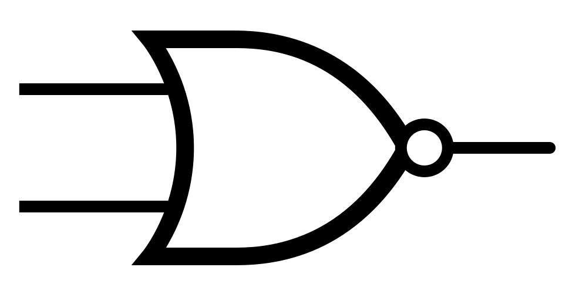

Other Gates
###########

There are other logic gates that are made from the 3 basic gates. Their functions are commonly used and that is why they are represented as gates.

NAND Gate
=========

It is the negated function of the AND gate.

Truth table

===    ===     =============
a	b	c = a NAND b
===    ===     =============
0	0	1
0	1	1
1	0	1
1	1	0
===    ===     =============

NAND Gate

NOR Gate
========

It is the negated function of the OR gate.

Truth table

===    ===     ============
a	b	c = a NOR b
===    ===     ============
0	0	1
0	1	0
1	0	0
1	1	0
===    ===     ============

NOR Gate

XOR Gate
========

If a and b are different the result is 1, otherwise 0.

===    ===     ============
a	b	c = a XOR b
===    ===     ============
0	0	0
0	1	1
1	0	1
1	1	0
===    ===     ============

XOR Gate

XNOR Gate
=========

If a and b are different the result is 0, otherwise 1.

===    ===     ============
a	b      c = a XNOR b
===    ===     ============
0	0	1
0	1	0
1	0	0
1	1	1
===    ===     ============

XNOR Gate

