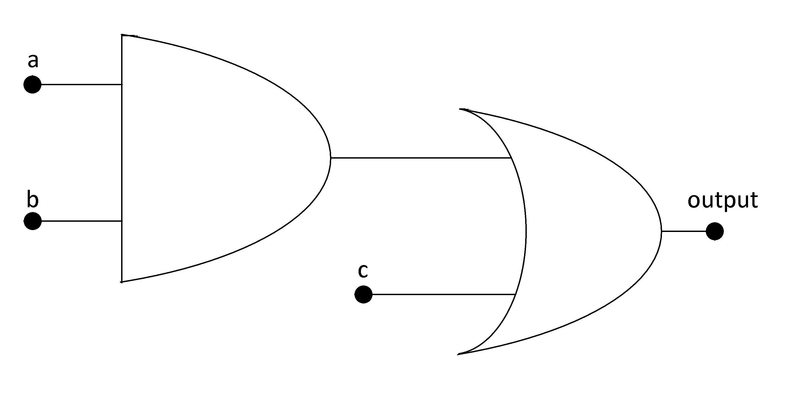

Boolean Functions
#################

A Boolean function is a function that has n variables or entries, so it has :math:`2^n` possible combinations of the variables. These functions will assume only 0 or 1 in its output. An example of a Boolean function is this, f(a,b,c) = a X b + c. These functions are implemented with the logic gates.

Digital circuit of f(a,b,c)

 
Truth table of the function

===    ===     ===      ========
a	b	c	f(a,b,c)
===    ===     ===      ========
0	0	0	0
0	0	1	1
0	1	0	0
0	1	1	1
1	0	0	0
1	0	1	1
1	1	0	1
1	1	1	1
===    ===     ===      ========

There is a way to implement functions in a canonical form, the minimal form of a function. For example if we had to implement a function with the truth table of the function f. First we would form the terms where the function has value 1, with only one possible combination for every term. The term would be 1 for one combination of the entry and 0 to the others. To do that we would use an AND gate and make that combination with all inputs equal 1 in the AND gate. The function then would be a sum of all terms. So the terms of the truth table would be:

Terms of the ∑

===    ===     ===     =========        ===============
a	b	c	f(a,b,c)	Terms of the ∑
0	0	0	0	        0
0	0	1	1	        !a X !b X c
0	1	0	0	        0
0	1	1	1	        !a X b X c
1	0	0	0	        0
1	0	1	1	        a X !b X c
1	1	0	1	        a X b X !c
1	1	1	1	        a X b X c
===    ===     ===     =========        ===============

|
.. math::

    f (a,b,c) &= (!a X !b X c) + (!a X b X c) + (a X !b X c) + (a X b X !c) + (a X b X c) \\
              &= !b X c X ( a + !a) + b X c X ( a + !a ) + a X b X !c \\
              &= !b X c + b X c + a X b X !c \\
              &= c + a X b X !c \\
              &= (c + a X b) X ( c + !c) = a X b + c

With the laws of Boolean algebra it is done a simplification to implement the digital circuit with the less number of gates.  
There is another way to implement the canonical function, which is to implement the negated function and then negate again and use De Morgan laws to retrieve a product of terms. This is the dual form of the summatory. The function now will be a product of terms and the terms now will have the value 0 for one combination of the input and 1 for every other combination.

Terms of the ∏

== == == =========   ============ ======== =================
a  b  c  !f(a,b,c)	Terms     f(a,b,c) Terms of the ∏
== == == =========   ============ ======== =================
0  0  0  1	     !a X !b X !c 0	   a + b + c
0  0  1  0	     0	          1	   1
0  1  0  1	     !a X b X !c  0	   a + !b + c
0  1  1  0	     0	          1        1
1  0  0  1	     a X !b X !c  0	   !a + b + c
1  0  1  0	     0	          1        1
1  1  0  0	     0	          1        1
1  1  1  0           0	          1        1
== == == =========   ============ ======== =================

.. math::

    !f (a,b,c) = !a X !b X !c + !a X b X !c + a X !b X !c

.. math::

    !!f = f &= !( !a X !b X !c + !a X b X !c + a X !b X !c) = !( !a X !b X !c) X !( !a X b X !c) X !( a X !b X !c) \\
            &= (a + b + c ) X (a X !b X c) X (!a X b X c) \\

Operating the terms we get the basic form that is f = a X b + c. 

The conclusion is that there are two ways to retrieve the canonical form of a function, which are the sum of the terms or its dual that is the product of the terms.
