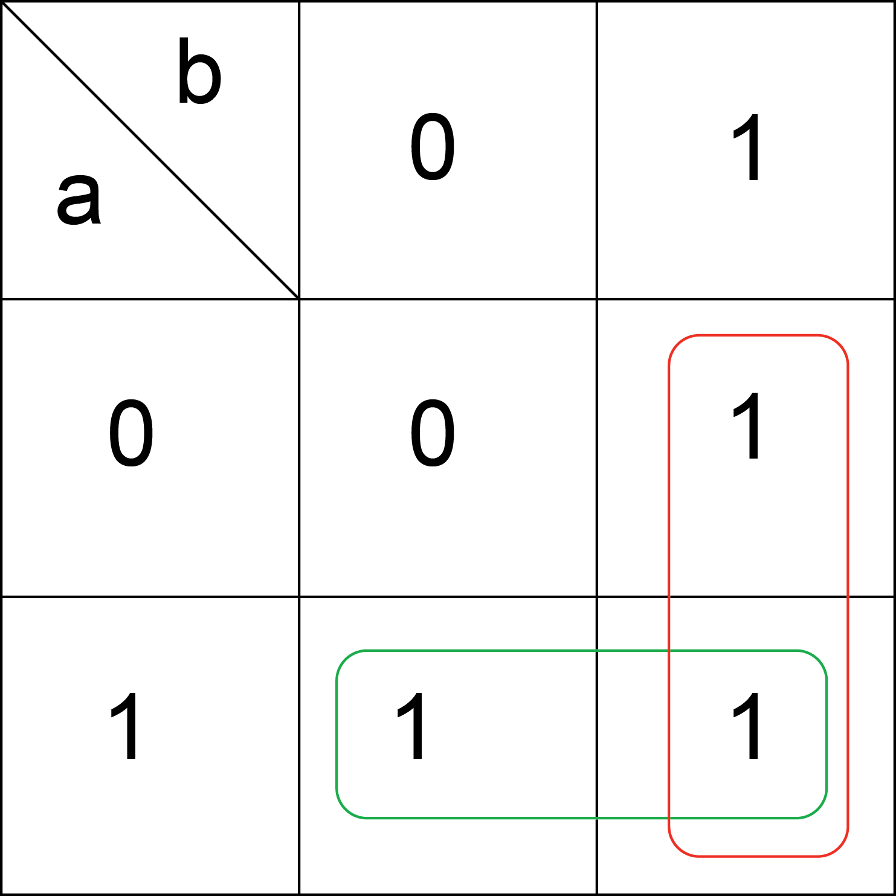
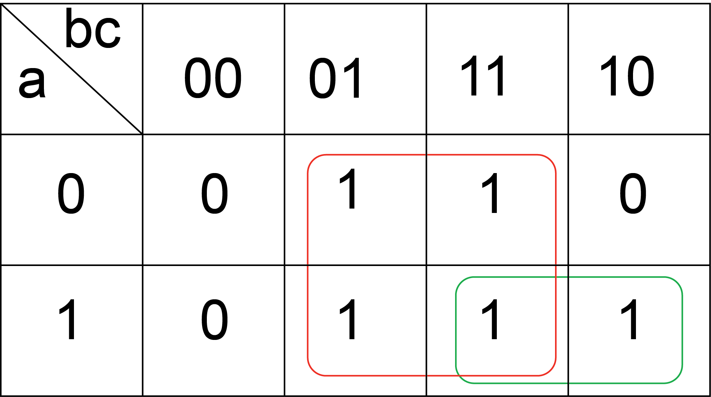
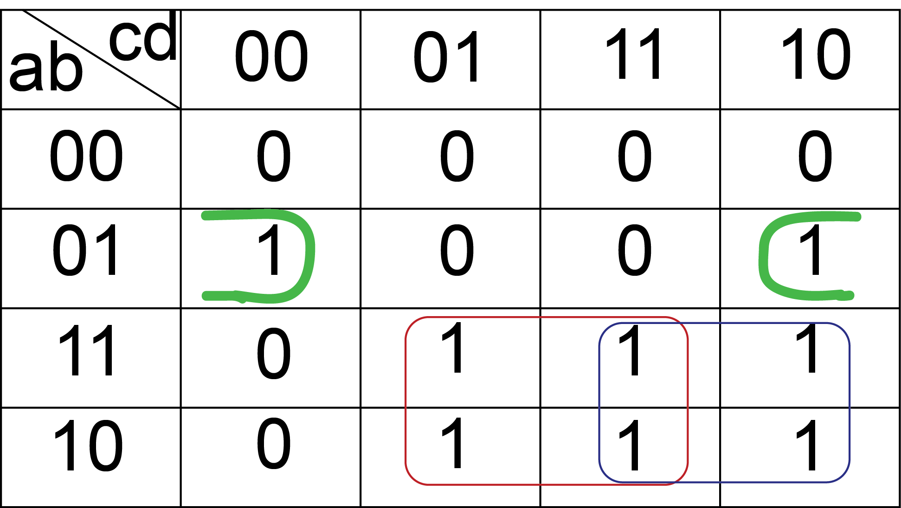

Karnaugh Map
############

This is a graphical method to simplify Boolean functions. It consists in grouping the terms of a truth table and to simplify it to use the fewer terms as possible. Let’s start with the OR function.

f(a,b) = a + b 

Truth Table

===     ===     ==========
a	b	f = a OR b
===     ===     ==========
0	0	0
0	1	1
1	0	1
1	1	1
===     ===     ==========

The function in canonical form is:

f = (!a X b) + (a X !b) + (a X b)     

---   repeating (a X b) because of a + a = a

f = (!a X b) + (a X !b) + (a X b) + (a X b)   

=b X (!a + a) + a X (!b + b) = b + a

The Karnaugh map is formed with the terms of the truth table:

Karnaugh Map

Grouping the terms in red give: !a X b + a X b = b

Grouping the terms in green give: a X !b + a X b = a

The result is f = a + b .

The terms must be grouped in multiples of power of two (2,4,8,16,...) and the objective is the simplification of the function. The bigger the group better is the simplification. All ones should be in one group and it is better to not repeat terms. If it is possible to make a group, the simplification will be better. Let’s do the example of the function f(a,b,c) = (a X b) + c

Truth Table of the Function

===     ===     ===     ========
a	b	c	f(a,b,c)
===     ===     ===     ========
0	0	0	0
0	0	1	1
0	1	0	0
0	1	1	1
1	0	0	0
1	0	1	1
1	1	0	1
1	1	1	1
===     ===     ===     ========

Karnaugh Map

!a X b X c is repeated twice.

Grouping the terms in green give: a X b X c + a X b X !c = a X b

Grouping the terms in red give: !a X !b X c + !a X b X c + a X !b X c + a X b X c  = c 

The result is f = (a X b) + c .

The next truth table represents a function with four input variables. The Karnaugh map will be a 4x4 square with 16 terms.

===     ===     ===     ===     ==========
a	b	c	d	f(a,b,c,d)
===     ===     ===     ===     ==========
0	0	0	0	0
0	0	0	1	0
0	0	1	0	0
0	0	1	1	0
0	1	0	0	1
0	1	0	1	0
0	1	1	0	1
0	1	1	1	0
1	0	0	0	0
1	0	0	1	1
1	0	1	0	1
1	0	1	1	1
1	1	0	0	0
1	1	0	1	1
1	1	1	0	1
1	1	1	1	1
===     ===     ===     ===     ==========

Karnaugh Map

Grouping the terms in green give: !a X b X !d

Grouping the terms in red give: a X d

Grouping the terms in blue give: a X c

The result is f = (!a X b X !d) + (a X d) + (a X c)
