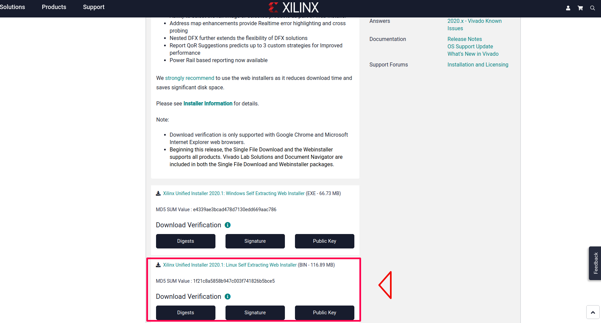
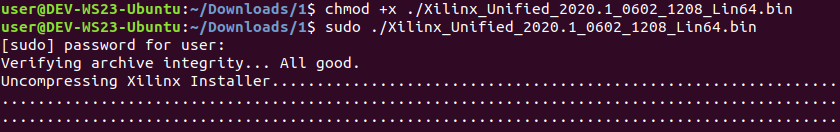
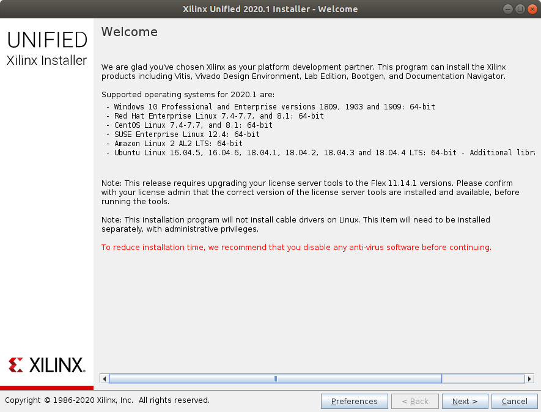
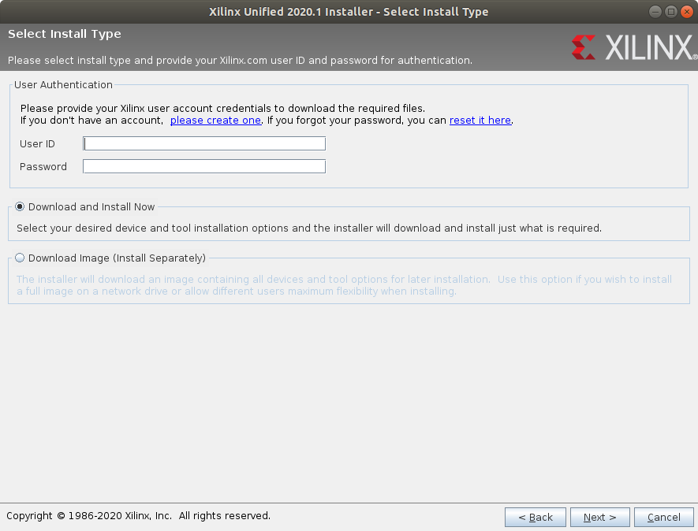
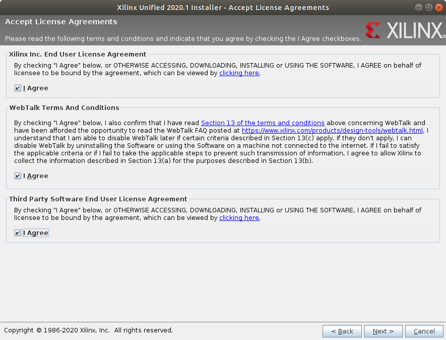
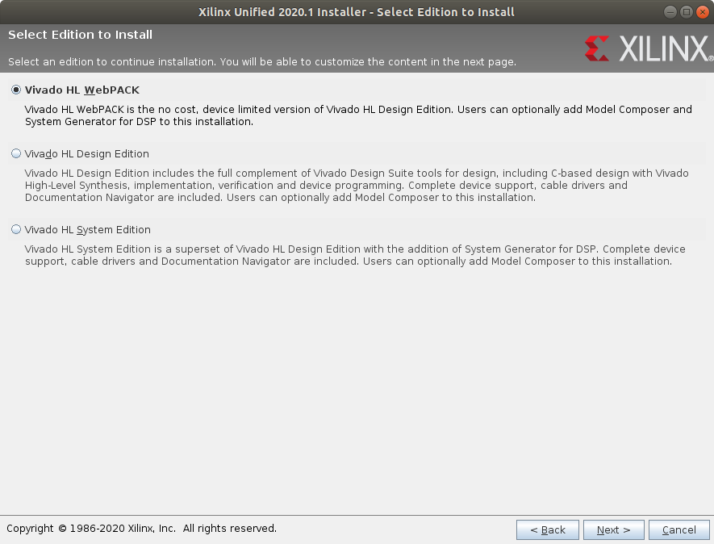
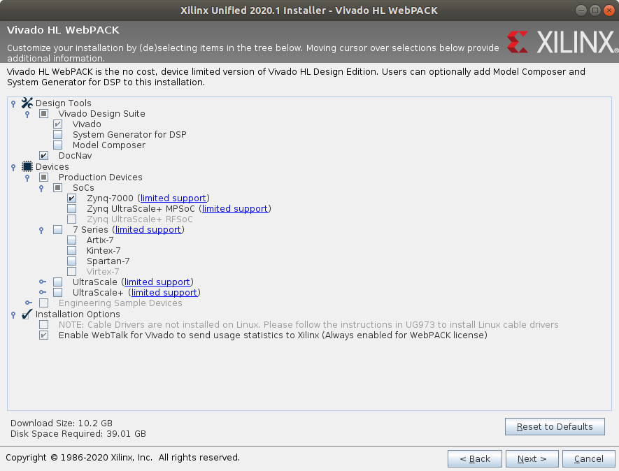
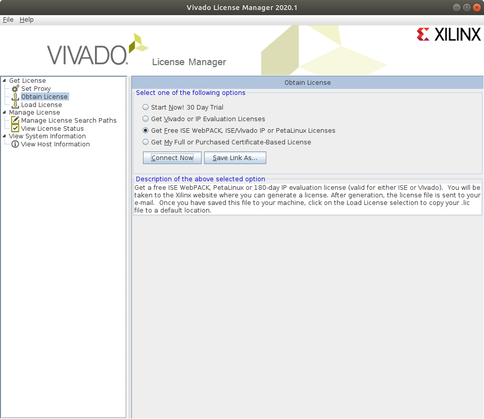

######################
Installation of Vivado
######################

This installation tutorial is intended for who want to use the FPGA of the Red Pitaya board. You will need to install the OS Ubuntu or the OS Linux Mint on your computer or on a virtual machine. After that follow the instructions to install Vivado.

**************
Install Vivado
**************

Download `Vivado Design Suite 2020.1 - HLx Editions - Linux Self Extracting Web Installer <https://www.xilinx.com/support/download/index.html/content/xilinx/en/downloadNav/vivado-design-tools/2020-1.html>`_ . If you don't have an Xilinx account you will have to create one, it's free. 

Now you have to run the downloaded file for installation. Open a terminal, go to the downloaded file directory (cd Downloads/) and insert the following commands. The first command is to make the file executable and the second to run the file.

.. code-block:: bash
    
    chmod +x ./Xilinx_Unified_2020.1_0602_1208_Lin64.bin
    sudo ./Xilinx_Unified_2020.1_0602_1208_Lin64.bin

It will open this installation wizard. Click Next.

Insert your Xilinx ID and password. Check **Download and install Now**. Click Next.

Check all the boxes. Click Next.

Check **Vivado HL WebPACK**. Click Next.

Check all the boxes in the next image. Uncheck Ultrascale and Ultrascale+ you don't need them. Click Next.

The default installation directory is **/opt/Xilinx**, so install there. Click Next.

Check the information and click Install. Now wait for the download and Installation.

It will open the license manager, and you will have to get the free WebPACK license file. Click **Connect Now** or **Save Link As**. This will open the Xilinx license manager site and you have to follow instructions to generate the **ISE WebPACK license**. You will receive the license file on your registered e-mail. After that click in **Load License** and click **Copy License** to copy your **.lic** file to register Vivado.

After installing Vivado install additional libraries by executing following command in Terminal

.. code-block:: bash

    sudo apt-get install libxft2 libxft2:i386 lib32ncurses5