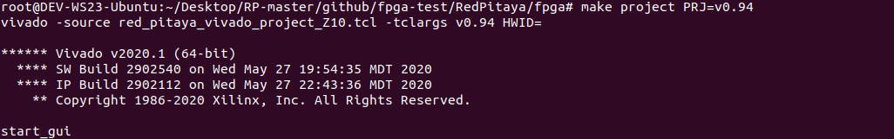
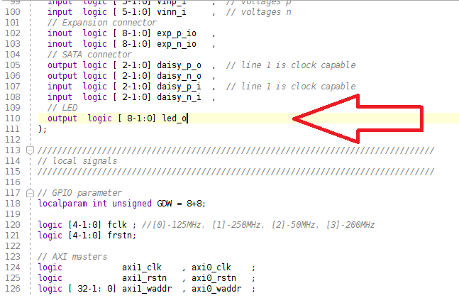
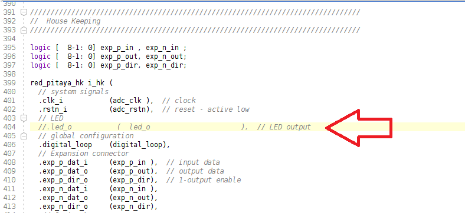
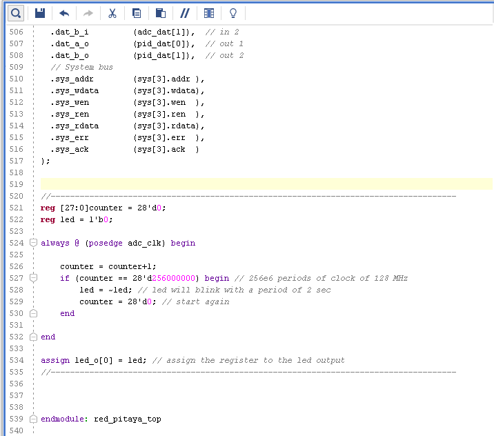
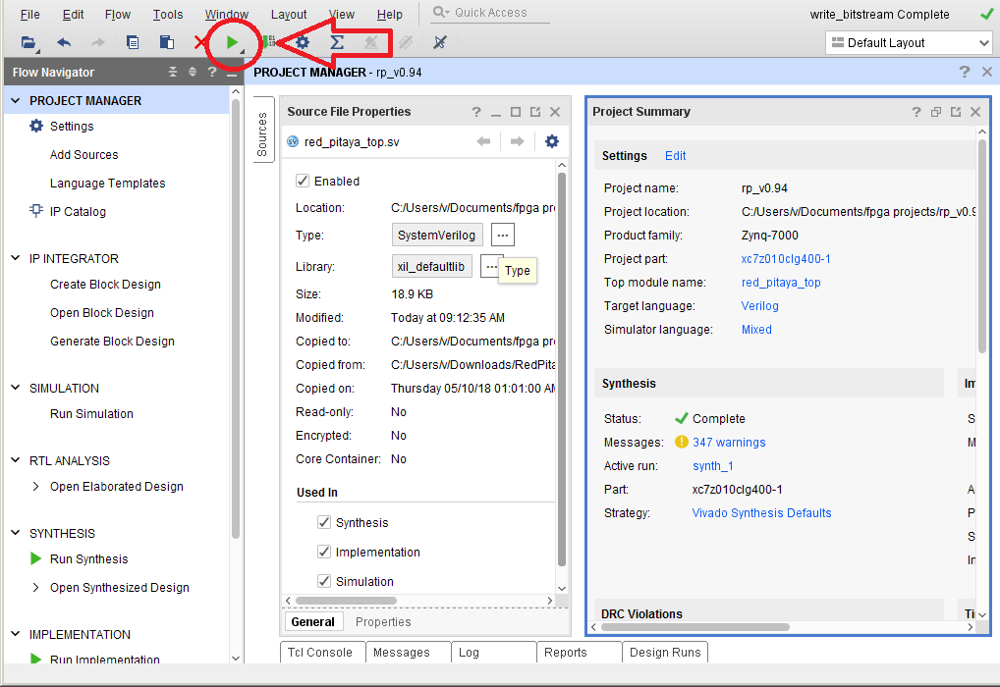
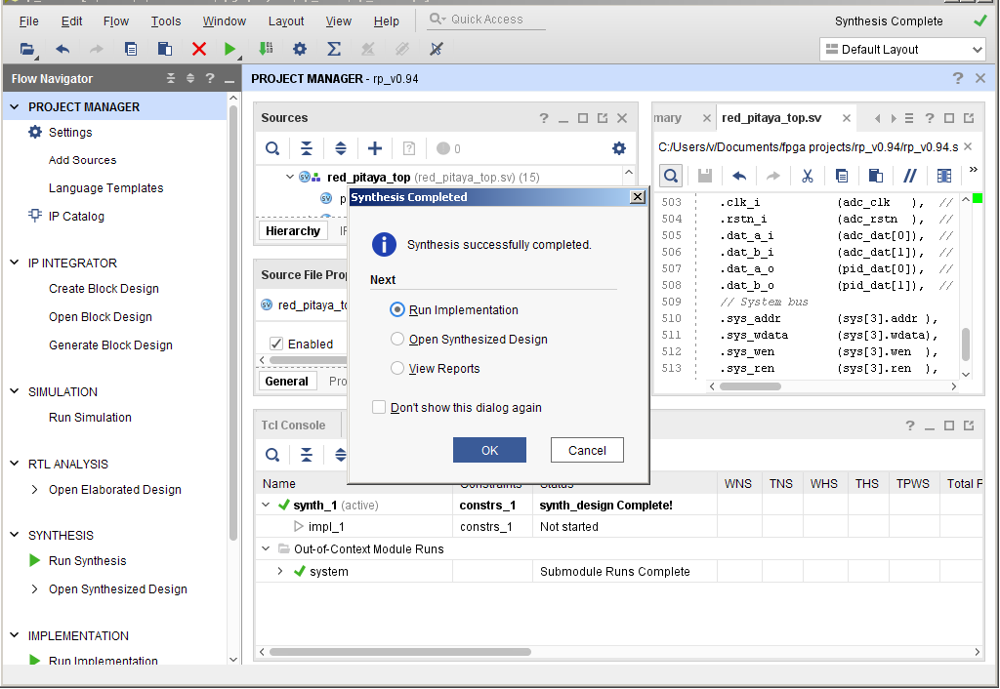
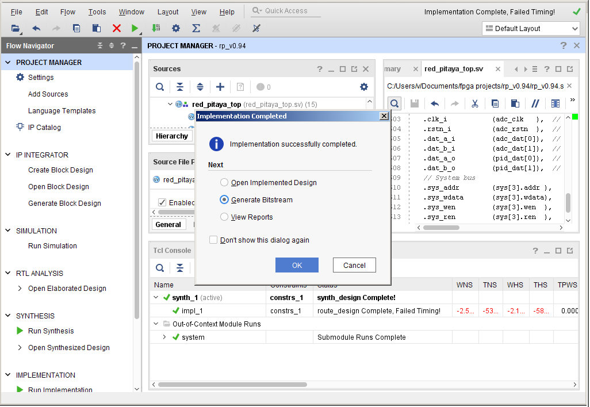

####################
Programming the FPGA
####################

After the installation of Vivado, we will have to clone the fpga repository and edit an existing project for our Hello World project.

****************************
Clone FPGA GitHub repository
****************************

Go to the `Red Pitaya GitHub <https://github.com/RedPitaya/RedPitaya>`_ site, and download the ZIP folder of this project.
 
.. image:: ./../img/clonerepo1.png
    :height: 200px
    :align: center

*******************
Make a FPGA project
*******************

Go to the downloaded ZIP location and extract it. You will enter the fpga folder and make a Vivado project. Open a Terminal and input the following commands.

.. code-block:: bash

    cd Downloads/
    cd RedPitaya-master/
    cd fpga/
    . /opt/Xilinx/Vivado/2020.1/settings64.sh
    make project PRJ=v0.94 MODEL=Z10

.. note::

    In order to open a project for model RP 122-16 or RP 250-12, you need to specify MODEL=Z20 or MODEL=Z20_250 as a parameter.

For this project you will only have to edit the **red_pitaya_top.sv** file. In the beggining of the file edit the port **led_o** assignment. Write the port as an **output logic**.

Now edit this part of the file and comment the **led_o** port.

Finally insert this code at the end of the module that has a purpose of led blinking. Input that before **endmodule: red_pitaya_top**.

.. code-block:: Verilog

    reg [27:0]counter = 28'd0; 
    reg led = 1'b0;
    always @ (posedge adc_clk) begin
        counter = counter+1;
        if (counter == 28'd256000000) begin // 256e6 periods of clock of 128 MHz
            led = ~led; // led will blink with a period of 2 sec
            counter = 28'd0; // start again
    end 
    end
    assign led_o[0] = led; // assign the register to the led output

Now you have to start Synthesis, Implementation and Write bitstream. Press the button to start the synthesization.

After finished synthesis. Start Implementation.

Finished Implementation. Start Write bitstream.

Now you have the bitstream file **red_pitaya_top.bit** located in .../fpga/prj/v0.94/project/repitaya.runs/impl_1

You have to send this file to your red pitaya board. Open a terminal and connect to red pitaya using ssh connection. In redpitaya enable read-write operation.

.. code-block:: bash
    
    ssh root@your Red Pitaya IP
    redpitaya> rw

Open another Terminal and go to the .bit file location.

.. code-block:: bash
    
    cd Downloads/RedPitaya-master/fpga/prj/v0.94/project/repitaya.runs/impl_1
    
Send the file .bit to redpitaya with scp command.

.. code-block:: bash
    
    scp red_pitaya_top.bit root@your Red Pitaya IP:/tmp

Go back to redpitaya Terminal, check if you have the copy red_pitaya_top.bit

.. code-block:: bash

    redpitaya> cd /tmp
    redpitaya>ls

Load fpga.bin to xdevcfg with

.. code-block:: bash

    redpitaya> cat /tmp/fpga.bin >/dev/xdevcfg

Congratulations the led should be blinking and you implemented the project in the FPGA.
