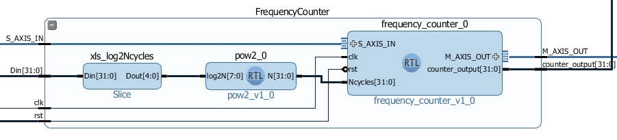

.. _freq_counter:

#################
Frequency Counter
#################

=============
Project setup
=============

* Windows 10 or Ubuntu 18.04
* Vivado 2020.1
* RepPitaya ecosystem project

Xilinx SDK is available from Xilinx downloads page:
https://www.xilinx.com/support/download/index.html/content/xilinx/en/downloadNav/vivado-design-tools/2020-1.html

Ecosystem:
https://github.com/RedPitaya/RedPitaya.git

To work with Vivado and its instruments in Windows we use TCL shell and Command prompt. Launch **Vivado HLS 2020.1 Command Prompt**
Change to the folder with cloned RedPitaya project and launch the project generation:

.. code-block:: shell-session

    cd C:/Users/RedPitaya/fpga
    vivado -source red_pitaya_vivado_project_Z10.tcl -tclargs v0.94

On Linux it will work via the terminal, however, to get access to some necessary commands you should execute settings64.sh (located in the Vivado folder). 
Then you can execute Vivado command. 

.. code-block:: shell-session

    /opt/Xilinx2/Vivado/2020.1/settings64.sh
    vivado -source red_pitaya_vivado_project_Z10.tcl -tclargs v0.94

When executing this command, the script will be launched and this script will generate a project for RedPitaya Z10 into the folder RedPitaya/fpga/prj/v0.94/project. 

============================================
Generation of an example from the repository
============================================

Move to folder RedPitaya/fpga/prj/Examples. Uncomment the line *"set project_name Frequency_counter"* and comment all files in the **make_project.tcl** file. Open Vivado and in Vivado Tcl Console navigate to the base folder: **RedPitaya\fpga\prj\Examples.** 

.. figure:: img/LedBlink1.png
    :alt: Logo
    :align: center

Then run the script source make_project.tcl. Tools → Run Tcl Script

.. figure:: img/LedBlink2.png
    :alt: Logo
    :align: center

**make_project.tcl** automatically creates a full project in the **RedPitaya/fpga/prj/Examples/Frequency_counter/** folder. Take a moment to examine the Block Design. 
If it is not open click on **Open Block Design** on the left-hand side of the window. 
When you are ready click **Generate Bitstream** at the bottom-left part of the window to generate a bitstream file. 
After you confirm that both Synthesis and Implementation will be executed beforehand the longer process starts.When synthesis, implementation and bitstream generation are successfully finished the bit file can be found at **Examples/tmp/Frequency_counter/tmp/Frequency_counter.runs/impl_1/system_wrapper.bit**

Copy newly generated bit file to the RedPitaya’s /root/tmp folder using WinSCP or type the following commands in Linux console

.. code-block:: shell-session

    cd examples/tmp/Frequency_counter/Frequency_counter.runs/impl_1/
    scp system_wrapper.bit root@your_rp_ip:Frequency_counter.bit

Finally, we are ready to program the FPGA with our own bitstream file located in the **/root/** folder on Red Pitaya. 
To program the FPGA simply execute the following line in the Linux console on your Red Pitaya (use Putty):

.. code-block:: shell-session

    cat /root/Frequency_counter.bit > /dev/xdevcfg

If you want to roll back to the official Red Pitaya FPGA program run

.. code-block:: shell-session

    cat /opt/redpitaya/fpga/fpga_X.XX.bit > /dev/xdevcfg

or simply restart Red Pitaya.

============
Introduction
============

On the way to a powerful acquisition systems let us make a quick detour and create a useful and simple project – `the Frequency Counter <https://en.wikipedia.org/wiki/Frequency_counter>`_. 
Yes, to measure frequencies one can use Red Pitaya’s native apps such as :ref:`Oscilloscope <osc_page>`  or :ref:`Spectrum Analyzer <spec_page>` , however, our program will be able to determine frequencies with much higher resolution and at the same time we will learn how to use Red Pitaya’s 125 Msamples/s 14-bit ADC and DAC peripherals in the FPGA program.

This project contains two separate parts: the *data acquisition* part with frequency counter and LED data display and the *signal generator* part. 
To communicate with these two parts we use the General Purpose IO block for setting configuration values and reading the counter output.

The frequency counter will be implemented in the `reciprocal counting scheme <https://www.best-microcontroller-projects.com/article-frequency-counter.html>`_ where a period of time of a predefined number of signal oscillations is measured and then inverted and divided by the number of oscillations. 
Such scheme can yield a much better frequency resolution, especially for low frequency signals, compared to the conventional method where number of signal cycles are counted in a predefined gate time.

================
Project overview
================

The full block design of the frequency counter project is composed of six parts:

* Processing System
* GPIO
* Signal Generator
* Data Acquisition
* Frequency Counter and Signal Decoder block as shown in the figure below.

    
    Block Design Overview

These parts will be described in detail below. You can skip the lengthy description and go directly to the fun part at the end of the post.

=================
Processing system
=================

Let’s start with the most common part – the processing system IP core. 
Together with the AXI Interconnect and Processor System Reset block these are the most common blocks in most of the Zynq 7000 FPGA applications. 
Since they take quite some space and have a lot of connections we will join them in a single hierarchy block, so they will take less space and make block design more transparent. 
To create a hierarchy select desired blocks, right click and select *Create Hierarchy*. 
From now on we will put in hierarchies most of the blocks with related functionality.

    
    Processing System 7 Hierarchy

=================================
General Purpose Input-Output Core
=================================

In the :ref:`previous post <stopwatch>` we have learned how to write and read from the FPGA logic. 
We will use the same approach here for setting configurations such as number of cycles and signal generator’s phase increment. 
We will use the first GPIO port as an input to make results of the frequency counter available to a program running on the Linux side. 
Second GPIO port will be used as an 32-bit output port containing 27-bit *phase_inc* value for the signal generator and 5-bit *log2Ncycles* value for the frequency counter:

.. math::

    gpio2\_io\_o[31:0] = _{31}[ \lbrace \text{27-bit}\ phase\_inc \rbrace \lbrace \text{5-bit}\ log2Ncycles \rbrace ]_{0}

If you ever need more configuration output bits you can use Pavel Demin’s *axi_configuration* IP core with a custom number of bits in a single output port. *axi_configuration* can be found in the *Frequency_counter/core* folder, which is automatically created with the *make_cores.tcl* script as described above.

================
Signal Generator
================

Signal Generator hierarchy creates a *sin(ωt)* and *cos(ωt)* signals at the two DAC output ports with a user defined frequency. 
The analog signal is generated with three blocks: *DDS compiler* for calculating 14-bit sinusoidal values, *Clock Wizard* to create a double clock frequency which allows setting the two DAC channels on each input clock cycle and *AXI-4 Stream Red Pitaya DAC* core for setting signal values to the external DAC unit. 
We will use 125 MHz *adc_clock* as input clock to achieve 125 Msamples/s data rate.

.. figure:: img/FreqCounter2.png
    :alt: Logo
    :align: center
    
    Signal Generator Hierarchy

Frequency, amplitude and other parameters can be set in the Direct Digital Synthesizer (DDS) re-customization dialog. 
Current DDS core settings will create *sin(ωt)* on one and *cos(ωt)* on the other DAC channel with maximal amplitude of +/- 1V (maximal range) on both channels.

The synthesized signal frequency is in the `DDS compiler <https://www.xilinx.com/support/documentation/ip_documentation/dds_compiler/v6_0/pg141-dds-compiler.pdf>`_ determined by a phase increment value at each clock cycle. 
A nice description of the signal synthesizer operation can be found in the DDS compiler product guide. 
The signal frequency can be set fixed at the design stage by choosing *Fixed* Phase Increment in the DDS re-customization dialog. 
In this case the dialog automatically calculates the required constant phase increment for a desired frequency and frequency resolution. 
Note that the output frequency will be a divisor of the clock frequency and might therefore deviate from the requested frequency.

Since we want to change the frequency during an operation we choose *Streaming* Phase Increment in the re-customization dialog, which requires a phase increment value to be continuously supplied to the S_AXIS_PHASE input interface. 
AXIS interface implements the `AXI4-Stream <https://www.xilinx.com/support/documentation/ip_documentation/axi_ref_guide/latest/ug1037-vivado-axi-reference-guide.pdf>`_ protocol developed for fast directed data flow. 
It implements the basic handshake using at least *tvalid* and *tready* signals, however, we will neglect even those for our nearly constant phase increment value.
To create a continuous stream of the user defined values we use Pavel Demin’s `AXI4-Stream Constant <https://github.com/apotocnik/redpitaya_guide/blob/master/cores/axis_constant_v1_0/axis_constant.v>`_ IP core, which converts 32-bit input bus to the AXIS master interface. 

AXI4-Stream Constant:

.. code-block:: verilog

    `timescale 1 ns / 1 ps

    module axis_constant #
    (
    parameter integer AXIS_TDATA_WIDTH = 32
    )
    (
    // System signals
    input  wire                        aclk,

    input  wire [AXIS_TDATA_WIDTH-1:0] cfg_data,

    // Master side
    output wire [AXIS_TDATA_WIDTH-1:0] m_axis_tdata,
    output wire                        m_axis_tvalid
    );

    assign m_axis_tdata = cfg_data;
    assign m_axis_tvalid = 1'b1;

    endmodule

For the input we take 27-bit *phase_inc* value from the *gpio2_io_o* port using Slice IP core. 
Calculation of the *phase_inc* for a desired output frequency will be discussed in the last part of the post.

Data Acquisition
================

AXI4-Stream Red Pitaya ADC Core
-------------------------------

The first block in the Data Acquisition hierarchy is the axis_red_pitaya_adc_v1_0 IP core with two main features. 
First, it converts the external 125 MHz clock from *adc_clk_a* and *adc_clk_b* differential external ports into our programmable logic as a *adc_clk* clock. 
Second, it reads the ADC data from two input channels which becomes available on each *adc_clk* clock cycle and makes it available over the AXI Stream (AXIS) interface M_AXIS. 
*axis_red_pitaya_adc_v1_0* IP core uses two ports of the AXIS interface, the *axis_tvalid* port which is always asserted and the *axis_tdata* a 32-bit data port with new measurements available on every clock cycle. 
32-bit *axis_tdata* contains 16-bit channel 2 value and 16-bit channel 1 value:

.. math::

    M\_AXIS\_tdata[31:0] = _{31}[\lbrace \text{16-bit}\ ADC2\ value \rbrace  \lbrace\ \text{16-bit}\  ADC1\ value\rbrace ]_{0}

Since Red Pitaya has 14-bit ADC the 16-bit value has two most significant bits set to either 00 or 11 depending on the sign of the measured value. 
It is instructive to have a look at the Verilog code of `AXI4-Stream Red Pitaya ADC core <https://github.com/RedPitaya/RedPitaya/blob/master/fpga/prj/Examples/Frequency_counter/cores/axis_red_pitaya_adc_v1_0/axis_red_pitaya_adc.v>`_.

.. code-block:: verilog

    `timescale 1 ns / 1 ps

    module axis_red_pitaya_adc #
    (
    parameter integer ADC_DATA_WIDTH = 14,
    parameter integer AXIS_TDATA_WIDTH = 32
    )
    (
    // System signals
    output wire                        adc_clk,

    // ADC signals
    output wire                        adc_csn,
    input  wire                        adc_clk_p,
    input  wire                        adc_clk_n,
    input  wire [ADC_DATA_WIDTH-1:0]   adc_dat_a,
    input  wire [ADC_DATA_WIDTH-1:0]   adc_dat_b,

    // Master side
    output wire                        m_axis_tvalid,
    output wire [AXIS_TDATA_WIDTH-1:0] m_axis_tdata
    );
    localparam PADDING_WIDTH = AXIS_TDATA_WIDTH/2 - ADC_DATA_WIDTH;

    reg  [ADC_DATA_WIDTH-1:0] int_dat_a_reg;
    reg  [ADC_DATA_WIDTH-1:0] int_dat_b_reg;
    wire                      int_clk0;
    wire 						int_clk;

    IBUFGDS adc_clk_inst0 (.I(adc_clk_p), .IB(adc_clk_n), .O(int_clk0));
    BUFG adc_clk_inst (.I(int_clk0), .O(int_clk));

    always @(posedge int_clk)
    begin
        int_dat_a_reg <= adc_dat_a;
        int_dat_b_reg <= adc_dat_b;
    end

    assign adc_clk = int_clk;

    assign adc_csn = 1'b1;

    assign m_axis_tvalid = 1'b1;

    assign m_axis_tdata = {
        {(PADDING_WIDTH+1){int_dat_b_reg[ADC_DATA_WIDTH-1]}}, ~int_dat_b_reg[ADC_DATA_WIDTH-2:0],
        {(PADDING_WIDTH+1){int_dat_a_reg[ADC_DATA_WIDTH-1]}}, ~int_dat_a_reg[ADC_DATA_WIDTH-2:0]};

    endmodule

.. note::

    Red Pitaya’s ADC core has an additional output port (adc_csn) connected to the external port *adc_csn_o* for a clock duty cycle stabilization.

    
    Data Acquisition Hierarchy

Signal Split  Module
--------------------

The second block in the hierarchy is the *signal_split* RTL module. 
It transforms ADC output interface M_AXIS with two channel values into two M_AXIS output interfaces each containing a single channel value. 
The module has a very simple Verilog code, which can be found on `github <https://github.com/RedPitaya/RedPitaya/blob/master/fpga/prj/Examples/Frequency_counter/signal_split.v>`_.

.. code-block:: verilog

    `timescale 1ns / 1ps

    module signal_split # 
    (
        parameter ADC_DATA_WIDTH = 16,
        parameter AXIS_TDATA_WIDTH = 32
    )
    (
        (* X_INTERFACE_PARAMETER = "FREQ_HZ 125000000" *)
        input [AXIS_TDATA_WIDTH-1:0]        S_AXIS_tdata,
        input                               S_AXIS_tvalid,
        (* X_INTERFACE_PARAMETER = "FREQ_HZ 125000000" *)
        output wire [AXIS_TDATA_WIDTH-1:0]  M_AXIS_PORT1_tdata,
        output wire                         M_AXIS_PORT1_tvalid,
        (* X_INTERFACE_PARAMETER = "FREQ_HZ 125000000" *)
        output wire [AXIS_TDATA_WIDTH-1:0]  M_AXIS_PORT2_tdata,
        output wire                         M_AXIS_PORT2_tvalid
    );
            
        assign M_AXIS_PORT1_tdata = {{(AXIS_TDATA_WIDTH-ADC_DATA_WIDTH+1){S_AXIS_tdata[ADC_DATA_WIDTH-1]}},S_AXIS_tdata[ADC_DATA_WIDTH-1:0]};
        assign M_AXIS_PORT2_tdata = {{(AXIS_TDATA_WIDTH-ADC_DATA_WIDTH+1){S_AXIS_tdata[AXIS_TDATA_WIDTH-1]}},S_AXIS_tdata[AXIS_TDATA_WIDTH-1:ADC_DATA_WIDTH]};
        assign M_AXIS_PORT1_tvalid = S_AXIS_tvalid;
        assign M_AXIS_PORT2_tvalid = S_AXIS_tvalid;

    endmodule

It is interesting to note that if you want to create an input or an output interface on a RTL module, simply name the input or output ports with a standard interface notation (see `Vivado IP user guide <https://www.xilinx.com/support/documentation/sw_manuals/xilinx2016_2/ug994-vivado-ip-subsystems.pdf`_). 
For example, in the signal_split RTL block port names: *S_AXIS_PORT1_tdata* and *S_AXIS_PORT1_tvalid* are automatically combined into an *S_AXIS_PORT1* interface.

Frequency Counter Module
========================

The frequency counter hierarchy is build around its main RTL module *frequency_counter* with two main inputs: *S_AXIS_IN* interface containing measured single channel ADC signal and Ncycles, a value that specifies a number of signal oscillation for time measurement. 
Since exact number for *Ncycles* is not important user specifies a 5-bit logarithmic value *log2Ncycles* via the gpio core. *Ncycles* is then calculated as

.. math::

   Ncycles = 2^{log2Ncycles}

using a pow2 RTL module. See the figure below.

    
    Frequency Counter Hierarchy

The verilog `code <https://github.com/RedPitaya/RedPitaya/blob/master/fpga/prj/Examples/Frequency_counter/frequency_counter.v>`_ of the *frequency_counter* RTL module has three main parts. The first part directly wires the *S_AXIS_IN* to the *M_AXIS_OUT* interface so that data is  transferred to the next block for processing. Instead, we could split the AXIS interface before the module, however, this would require an additional IP core – the AXI3-Stream Broadcaster.

.. code-block:: verilog

    `timescale 1ns / 1ps
    
    module frequency_counter #
    (
        parameter ADC_WIDTH = 14,
        parameter AXIS_TDATA_WIDTH = 32,
        parameter COUNT_WIDTH = 32,
        parameter HIGH_THRESHOLD = -100,
        parameter LOW_THRESHOLD = -150
    )
    (
        (* X_INTERFACE_PARAMETER = "FREQ_HZ 125000000" *)
        input [AXIS_TDATA_WIDTH-1:0]   S_AXIS_IN_tdata,
        input                          S_AXIS_IN_tvalid,
        input                          clk,
        input                          rst,
        input [COUNT_WIDTH-1:0]        Ncycles,
        output [AXIS_TDATA_WIDTH-1:0]  M_AXIS_OUT_tdata,
        output                         M_AXIS_OUT_tvalid,
        output [COUNT_WIDTH-1:0]       counter_output
    );
        
        wire signed [ADC_WIDTH-1:0]    data;
        reg                            state, state_next;
        reg [COUNT_WIDTH-1:0]          counter=0, counter_next=0;
        reg [COUNT_WIDTH-1:0]          counter_output=0, counter_output_next=0;
        reg [COUNT_WIDTH-1:0]          cycle=0, cycle_next=0;
        
        
        // Wire AXIS IN to AXIS OUT
        assign  M_AXIS_OUT_tdata[ADC_WIDTH-1:0] = S_AXIS_IN_tdata[ADC_WIDTH-1:0];
        assign  M_AXIS_OUT_tvalid = S_AXIS_IN_tvalid;
        
        // Extract only the 14-bits of ADC data 
        assign  data = S_AXIS_IN_tdata[ADC_WIDTH-1:0];
    
        
        
        // Handling of the state buffer for finding signal transition at the threshold
        always @(posedge clk) 
        begin
            if (~rst) 
                state <= 1'b0;
            else
                state <= state_next;
        end
        
        
        always @*            // logic for state buffer
        begin
            if (data > HIGH_THRESHOLD)
                state_next = 1;
            else if (data < LOW_THRESHOLD)
                state_next = 0;
            else
                state_next = state;
        end
        

        // Handling of counter, counter_output and cycle buffer
        always @(posedge clk) 
        begin
            if (~rst) 
            begin
                counter <= 0;
                counter_output <= 0;
                cycle <= 0;
            end
            else
            begin
                counter <= counter_next;
                counter_output <= counter_output_next;
                cycle <= cycle_next;
            end
        end

        always @* // logic for counter, counter_output, and cycle buffer
        begin
            counter_next = counter + 1; // increment on each clock cycle
            counter_output_next = counter_output;
            cycle_next = cycle;
            
            if (state < state_next) // high to low signal transition
            begin
                cycle_next = cycle + 1; // increment on each signal transition
                if (cycle >= Ncycles-1) 
                begin
                    counter_next = 0;
                    counter_output_next = counter;
                    cycle_next = 0;
                end
            end
    end

        
    endmodule

The second part of the code sets the *state* buffer depending on the measured signal value relative to the high or low threshold values. 
If the signal is above the high threshold value *state* buffer is set to one and if the signal is below the low threshold value *state* buffer is set to 0. 
Using two threshold values helps to prevent false state transitions in case of noisy data.

The third part increments *counts* register on each clock cycle, increments *cycles* register on each positive state transition and clears *cycles* and *counter* registers when cycles exceeds *Ncycles*. 
Before clearing the counter its value is copied to the *counter_output* register which is wired to the output port. 
The result of the frequency counter module is therefore a number of clock cycles in a time of *Ncycles* signal oscillations, updated on each *Ncycles* signal oscillations. 
The frequency is then calculated as

.. math::

    frequency=\frac{Ncycles*125 MHz}{counts}

Signal Decode Module
====================

The final block in the ADC signal chain and in the block design is the *signal_decode* RTL module.
Its purpose is to display the ADC value on the Red Pitaya LED bar mostly for visual effects. 
The implementation is a simple 8-bit `decoder <http://www.asic-world.com/examples/verilog/decoder.html>`_ from Vivado’s Language Templates. In `signal_decoder.v <https://github.com/RedPitaya/RedPitaya/blob/master/fpga/prj/Examples/Frequency_counter/signal_decoder.v>`_ the three MSBs of the ADC value are decoded and displayed on LEDs. 

.. code-block:: verilog

    `timescale 1ns / 1ps
   
    module signal_decoder # 
    (
        parameter ADC_WIDTH = 14,
        parameter AXIS_TDATA_WIDTH = 32,
        parameter BIT_OFFSET = 4 // 4 for +/-20 V or 0 for +/-1 V ADC voltage range setting
    )
    (
        (* X_INTERFACE_PARAMETER = "FREQ_HZ 125000000" *)
        input [AXIS_TDATA_WIDTH-1:0]    S_AXIS_tdata,
        input                           S_AXIS_tvalid,
        input                           clk,
        input                           rst,
        output reg [7:0]                led_out
    );
        wire [2:0] value;
        
        assign value = S_AXIS_tdata[ADC_WIDTH-BIT_OFFSET-1:ADC_WIDTH-BIT_OFFSET-3];
    
        always @(posedge clk)
        if (~rst)
            led_out <= 8'hFF;
        else
            case (value)
                3'b011  : led_out <= 8'b00000001;
                3'b010  : led_out <= 8'b00000010;
                3'b001  : led_out <= 8'b00000100;
                3'b000  : led_out <= 8'b00001000;
                3'b111  : led_out <= 8'b00010000;
                3'b110  : led_out <= 8'b00100000;
                3'b101  : led_out <= 8'b01000000;
                3'b100  : led_out <= 8'b10000000;
                default : led_out <= 8'b00000000;
            endcase
    endmodule

However, if your ADC range jumpers are set to +/- 20 V instead of +/-1 V you will see no activity when connecting the output of the Red Pitaya’s DAC to the input of its ADC port. 
In this case *BIT_OFFSET* parameter can be set to 4 to decode 4th, 5th and 6th signal’s MSBs. 
Shifting the bit position is related to signal amplification by a factor of 2. You can play with this value if the range is not optimal.

Fun Part
========

We are ready to test the frequency counter. Connect the Red Pitaya’s OUT1 port to the IN1 port. Save the project, create bitstream and write it to the FPGA as described in previous projects.

Next, copy the `counter.c <https://github.com/RedPitaya/RedPitaya/blob/master/fpga/prj/Examples/Frequency_counter/server/counter.c>`_  program found in *Frequency_counter/server* folder to Red Pitaya’s  Linux, compile it and execute it as shown in the figure below.

.. code-block:: c

    #include <stdio.h>
    #include <stdint.h>
    #include <unistd.h>
    #include <sys/mman.h>
    #include <fcntl.h>
    #include <stdlib.h>

    int main(int argc, char **argv)
    {
        int fd;
        int log2_Ncycles;
        uint32_t phase_inc;
        double phase_in, freq_in;
        uint32_t count;
        void *cfg;
        char *name = "/dev/mem";
        const int freq = 125000000; // Hz
        int Ncycles; 

        if (argc == 3) 
        {
            log2_Ncycles = atoi(argv[1]);
            freq_in = atof(argv[2]);
        }
        else 
        {
            log2_Ncycles = 1;
            freq_in = 1.;
        }
        phase_inc = (uint32_t)(2.147482*freq_in);
        Ncycles = 1<<log2_Ncycles;

        if((fd = open(name, O_RDWR)) < 0)
        {
            perror("open");
            return 1;
        }

        cfg = mmap(NULL, sysconf(_SC_PAGESIZE), PROT_READ|PROT_WRITE, MAP_SHARED, fd, 0x42000000);
        

        *((uint32_t *)(cfg + 8)) = (0x1f & log2_Ncycles) + (phase_inc << 5);   // set log2_Ncycles and phase_inc

        count = *((uint32_t *)(cfg + 0));
        printf("Counts: %5d, cycles: %5d, frequency: %6.5f Hz\n", count, Ncycles, (double)Ncycles/count*freq);

        munmap(cfg, sysconf(_SC_PAGESIZE));

        return 0;
    }

    
    Demonstration of counter.c program

The program can be used with the following parameters:

.. code-block:: shell-session

    ./counter {log2Ncycles} {frequency_Hz}

Keep in mind that the frequency resolution depends on the number of clock counts within *Ncycles* signal oscillations. 
Low frequency signals require small *Ncycles* and high frequencies signals require large *Ncycles*. 
The maximal number of counts can be 2^32, the highest DAC frequency can be 125 MHz/4 = 31.25 MHz and the lowest frequency can be approx. 1 Hz. 
The conversion from the desired frequency into the phase_inc is done in the *counter.c*.

When setting the frequency to 2 Hz the LED bar on the Red Pitaya board looks very much like Knight Rider’s lights
