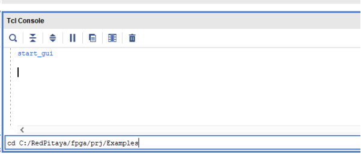
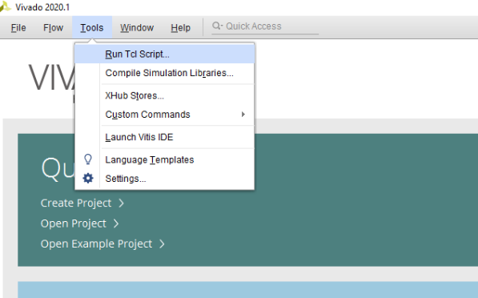

############
Knight Rider
############

=============
Project setup
=============

* Windows 10 or Ubuntu 18.04
* Vivado 2020.1
* RepPitaya ecosystem project

Xilinx SDK is available from Xilinx downloads page:
https://www.xilinx.com/support/download/index.html/content/xilinx/en/downloadNav/vivado-design-tools/2020-1.html

Ecosystem:
https://github.com/RedPitaya/RedPitaya.git

To work with Vivado and its instruments in Windows we use TCL shell and Command prompt. Launch **Vivado HLS 2020.1 Command Prompt**
Change to the folder with cloned RedPitaya project and launch the project generation:

.. code-block:: shell-session

    cd C:/Users/RedPitaya/fpga
    vivado -source red_pitaya_vivado_project_Z10.tcl -tclargs v0.94

On Linux it will work via the terminal, however, to get access to some necessary commands you should execute settings64.sh (located in the Vivado folder). 
Then you can execute Vivado command. 

.. code-block:: shell-session

    /opt/Xilinx2/Vivado/2020.1/settings64.sh
    vivado -source red_pitaya_vivado_project_Z10.tcl -tclargs v0.94

When executing this command, the script will be launched and this script will generate a project for RedPitaya Z10 into the folder RedPitaya/fpga/prj/v0.94/project. 

============================================
Generation of an example from the repository
============================================

Move to folder RedPitaya/fpga/prj/Examples. Uncomment the line *"set project_name Knight_rider"* and comment all files in the **make_project.tcl** file. Open Vivado and in Vivado Tcl Console navigate to the base folder: **RedPitaya\fpga\prj\Examples.** 

Then run the script source make_project.tcl. Tools → Run Tcl Script

**make_project.tcl** automatically creates a full project in the **RedPitaya/fpga/prj/Examples/Knight_rider/** folder. Take a moment to examine the Block Design. 
If it is not open click on **Open Block Design** on the left-hand side of the window. 
When you are ready click **Generate Bitstream** at the bottom-left part of the window to generate a bitstream file. 
After you confirm that both Synthesis and Implementation will be executed beforehand the longer process starts.When synthesis, implementation and bitstream generation are successfully finished the bit file can be found at **Examples/tmp/Knight_rider/tmp/Knight_rider.runs/impl_1/system_wrapper.bit**

Copy newly generated bit file to the RedPitaya’s /root/tmp folder using WinSCP or type the following commands in Linux console

.. code-block:: shell-session

    cd examples/tmp/Knight_rider/Knight_rider.runs/impl_1/
    scp system_wrapper.bit root@your_rp_ip:Knight_rider.bit

Finally, we are ready to program the FPGA with our own bitstream file located in the **/root/** folder on Red Pitaya. 
To program the FPGA simply execute the following line in the Linux console on your Red Pitaya (use Putty):

.. code-block:: shell-session

    cat /root/Knight_rider.bit > /dev/xdevcfg

Now, you should see the LEDs blink. Don’t worry, you did not destroy your Red Pitaya. If you want to roll back to the official Red Pitaya FPGA program run

.. code-block:: shell-session

    cat /opt/redpitaya/fpga/fpga_X.XX.bit > /dev/xdevcfg

or simply restart Red Pitaya.

============
Introduction
============

A blinking LED is one thing, but a true light show is something one can actually be proud of. 
In the :ref:`LED Blink <ledblink>` we built a very simple FPGA program that made one LED on Red Pitaya blink. 
For such a simple project we constructed the necessary logic by graphically connecting different blocks in *Vivado’s IP Integrator* without writing a single line of code. 
Of course, not all applications will be so simple and we will eventually have to learn hardware definition language (HDL). 
To get acquainted with Verilog HDL we will in this project build FPGA program for Red Pitaya where eight lights slide like in the cult series the Knight Rider.

.. raw:: html

    

        <iframe src="https://www.youtube.com/embed/Mo8Qls0HnWo" frameborder="0" allowfullscreen style="position: absolute; top: 0; left: 0; width: 100%; height: 100%;"></iframe>
    

==============
Verilog Module
==============

In order to make Red Pitaya simulate Knight Rider light sequence we will use Verilog language to write a custom module that will provide logic behind the continuous light sequence. 
There are two popular hardware description languages: `VHDL <https://en.wikipedia.org/wiki/VHDL>`_ and `Verilog <https://en.wikipedia.org/wiki/Verilog>`_.
We will choose the later since most of the official Red Pitaya FPGA code is written in Verilog and because it is somewhat similar to C programming language which some readers might be familiar with. 
Once *knight_rider* module will be written we will test it and then incorporate it in the block design we created in :ref:`LED Blink <ledblink>`. 
We will also demonstrate how to use the parallel nature of a FPGA to create a double Knight Rider light sequence.

To start off open or create LED blinker project 1 in Vivado as described in the :ref:`previous post <ledblink>`. 
Once the project is opened create a new source file (*Project Manager -> Add Sources -> Add or create design *), choose file type: Verilog and file name: *knight_rider*. 
When asked to set modules ports click OK and confirm to use default settings. Open the newly created source file by double clicking on the *knight_rider.v* under *Design Sources* in *Sources* tab.

We are ready to enter our Verilog code. Replace the content of the file with the following code:

.. code-block:: verilog

    module knight_rider(
        input clk,
        output [7:0] led_out
        );
        
        parameter LEDS_INIT = 10'b1100000000;
        parameter DIR_INIT = 1;
        
        reg [9:0] leds = LEDS_INIT; // register for led output
        reg [3:0] position = DIR_INIT*8; // state counter 0-15
        reg direction = DIR_INIT;   // direction indicator
    
        always @ (posedge clk)
        begin
            if (direction == 0) begin
                leds <= leds << 1;  // bit-shift leds register
            end else begin
                leds <= leds >> 1;  // bit-shift leds register
            end
            position <= position + 1;
        end
    
        always @*              	// change direction
        begin    	
            if (position < 8) begin  	// in the second half
                direction = 0;
            end else begin
                direction = 1;
            end
        end
    
        assign led_out = leds[8:1]; // wire output and leds register
        
    endmodule

At the top of the code we first declare the module’s name *knight_rider* with *clk* as input and 8-bit wide led_out as output port. 
Below the module’s declaration we find definition of internal registers. Here, for example, *reg [3:0]* position means that position is a 4-bit register with *reg[3]* being the most- (MSB) and *reg[0]* being the least-significant bit (LSB). 
The parameters *LEDS_INIT* and *DIR_INIT* are constants defined at the design level.

Below the internal register definitions one can find the first *always@(sensitivity_list)* block. 
This procedural block is executed at each change of the signals listed in the sensitivity list. 
In our case the block will be executed on each positive edge of the *clk* signal. 
Following the always statement is the *begin–end* block where the code is executed sequentially as we are used in the procedural programming. 
Keep in mind that the code will be ultimately implemented as logic circuits with gates, flip-flops and wires. 
In the same way there can be several independent circuits on the FPGA we can use several *always* blocks in a module, all running in parallel. 
A good practice is to write several short procedural blocks, for which it is almost possible to guess their implementation, and then connect them so they perform a task.

Our first *always* block assigns a new value to *leds* and *position* registers at each clock cycle depending on the value of the *direction* register. 
We use bit-shift operators (>>, <<) to achieve Knight Rider’s sliding effect. 
In this block we only use *non-blocking assignment* (<=) which assigns the values only when all the right-hand side expressions are evaluated, effectively at the end of the block. In this case the order of assignment is not defined and we should be careful that our code does not depend on that.

The second *always* block is sensitive to any signals in the always block. 
During the first 8 clock cycles direction of bit-shifts will be towards the left and in the second 8 cycles direction will be towards the right. 
Since *position* is a 4-bit register it will reset to 0 as soon as it will exceed its largest value (15). 
This will reset and start over the 16-count sequence where two lit LEDs move from one end to the other and back. 
In the second *always* block we use *blocking assignment* (=) to assign to direction register. 
As the name suggests this will block the execution until the right-hand side of the expression is evaluated and then immediately assign the value to the register on the left-hand side. 
In this way the register will be updated at the next line in code. 
Blocking assignment is usually used within the *always* blocks when we want to get a logic circuit made of gates and not latches or flip-flops. 
It is a good practice not to mix blocking and non-blocking assignments within one *always* block.

The last line in the module uses the third assignment method using an *assign* keyword. 
This assignment is used to directly wire registers and ports or in our case the subset of bits from the *leds* register to the *led_out* port. 
Due to the direct wiring any change in the leds register will be immediately propagated to the output port.

This was a very quick introduction to some of the Verilog language concepts. 
To get a more complete introduction there is a number of good online tutorials and books that can help you. Some of the links can be found in the Literature section at the end of this post. 
Now, that we wrote our first module we need to test it.

==========
Simulation
==========

We will use Vivado’s integrated *Simulator* to test the module and debug the code. 
Simulation is done using a new test bench module where we define a time dependent input signals, instantiate the module under test and collect the output signals. 
To create a test bench module click on *Add Sources -> Add or create simulation sources*, then create a file with file type: Verilog and file name: *knight_rider_tb.v*. 
No ports need to be defined under Define Module dialog.

Once the *knight_rider_tb.v* file is created open it and replace its content with the following code:

.. code-block:: verilog

    `timescale 1ns / 1ps
    
    module knight_rider_tb();
            
        reg clock;
        wire [7:0] out;
    
        knight_rider kr (.clk(clock),
                        .led_out(out)
                        );
        
        initial begin
            clock = 0;
            forever #1 clock = ~clock;
        end
        
    endmodule

The test bench module defines a register called *clock* and 8-bit wire called *out*. 
After the register and wire declaration we define (on line 8) an instance of *knight_rider* module with a name *kr* and connect register *clock* to knight_rider’s port *clk* and wire *out* to knight_rider’s port led_out. 
Note that we use wire for the out register since we only need to display it on the Simulator’s waveform graph.

The final part of the test bench module is the *initial* block where we set the initial value of the clock register and then toggle it forever with 1 ns delay specified by #1 after *forever* keyword. 
The unit of time and the simulation resolution is defined at the top of the code with the statement: *`timescale 1ns / 1ps*.

We are ready to simulate the behavior of our module. Save the test bench file and set it as top by right clicking on the file in the *Source tab* and choose *Set as Top*. 
Next, we click on *Run Simulation* button on the left hand side of the window and choose *Run Behavioral Simulation*. 
To properly display the results use *View->Zoom* in or *View->Zoom* fit functions to zoom in to the first 50 ns of the simulated waveform. 
You can also expand wire *out* to see the value of individual bits. We can add internal registers of *knight_rider* module to our waveform by dragging them from *knight_rider->kr* icon under *Scopes* panel to the list of signals at the left-hand side of the black waveform region. 
In the picture below you can see that we added *position* and *direction* registers. 
To update the waveform click on *Run->Restart* and *Run->Run For…* buttons in the main menu. You can change the format of displayed numbers in the waveform by right clicking on the signal name in the waveform region and choosing for example *Radix -> Unsigned Decimal*.

    
    Knight_rider’s simulation waveform

In Vivado we can also debug our code by inserting breakpoints in Verilog’s code. 
This can be done by clicking on the empty circles that appear right from the line numbers in Vivado’s text editor. 
Other debugging functions such as *Restart…, Run For…, Step, Break,* etc. can be found in the toolbar or in the *Run* menu. 
Fore more information on simulation and debugging see Xilinx’s `logic simulation tutorial <https://www.xilinx.com/support/documentation/sw_manuals/xilinx2016_1/ug937-vivado-design-suite-simulation-tutorial.pdf>`_.

After inspecting the simulated waveform we happily conclude that the *knight_rider* module performs as expected. We are ready to incorporate it into the block design.

============
Block Design
============

Any module in the Vivado’s source folder can be added to the block diagram by right-clicking on the block design’s white canvas and choosing *Add Module…* Click on the *knight_rider* module and confirm. 
A new block with RTL icon appears in the block diagram. To incorporate it into the structure we connect *clk* port to the output of *xlslice_0* block and *led_out* port to the *led_o* external port as shown in the figure below. 
Note that from Vivado 2020.1 util_ds_buf_1 and util_ds_buf_2 have to be connected for a successful implementation.

    
    Block Design

We can set the constant parameters of the module by double-clicking on the *knight_rider_0* block and setting the two parameters as shown below.

.. code-block:: verilog

    LEDS_INIT = "1100000000"
    DIR_INIT = 0

Knight rider module uses all 8 available LEDs on the Red Pitaya board. 
To connect the module’s output to all of them we need to change the width of the external *led_o* port from currently 1 to 8 bits. 
This can be done by setting *led_o* port’s LEFT parameter to 7 under the port properties (select the *led_o* port on the block design and locate properties dialogue at the left-hand side of the *IP Integrator*). 
In the xlslice_0 block set both *Din From* and *Din Down* To fields to 23.

The project is ready for synthesis, implementation and generating bitstream. 
As we learned in the :ref:`previous project <ledblink>` copy the bitstream file to the linux home folder on Red Pitaya and write it to the FPGA using

.. code-block:: shell-session

    cat /root/tmp/your_bitstream.bit > /dev/xdevcfg

The LEDs on your Red Pitaya should now blink in the famous Knight Rider fashion.

===================
Double Knight Rider
===================

We can make the another Knight Rider light sequence where two sets of light streams move in opposite, mirrored direction. 
This can be done by adding another instance of the *knight_rider* module to the block design. 
The input *clk* of the new block is connected to the same clock as the first *knight_rider* module. 
The outputs of the two modules have to be first joined by a vector logic OR block whose output is then wired to the *led_o* port. 
As we have learned in the :ref:`previous project <ledblink>` the vector logic block can be found under Xilinx’s IP cores (Right click on the white block design canvas and choose *Add IP…*). 
It will perform a pair-wise logic operation for each pair of elements in the two input vectors. 
To get a mirrored behavior of the second *knight_rider* block its parameters should be set as

.. code-block:: verilog

    LEDS_INIT = "0000000011"
    DIR_INIT = 1

The block design for the Double Knight Rider is shown in the following figure. 

.. note::

    *util_ds_buf_1* and *util_ds_buf_2* have to be connected for a successful implementation.

    
    Block Design

Double Knight Rider light sequence is a great demonstration of parallel nature of the FPGA. 
We simply added another instance of the module and connect it to the clock. 
Both blocks are implemented as separate logic circuits on the FPGA running perfectly in parallel.
The project is again ready for synthesis, implementation and bitstream generation. 
Enjoy the light show on your Red Pitaya! You can of course change the frequency of the blinking LEDs by changing the parameter in *xlslice_0* block.

==========
Conclusion
==========

In this project we built a simple but nontrivial FPGA application – Knight Rider Lights, ideal for learning the basic concepts of FPGA programming.
In this post we got familiar with Verilog language which we used to create our own module. 
We tested this module using Vivado’s simulator and finally inserted one or more instances into the block diagram. For the first time we had to think in terms of circuits were wires connect different parts of the system and where different blocks can run independent from each other. 
This inherent parallelism is one of the reasons why FPGAs are so popular for example in the `high-performance computing <https://en.bitcoin.it/wiki/Open_Source_FPGA_Bitcoin_Miner>`_.
In the first two projects FPGA programs were completely determined at the design level, without control during the execution. 
We will learn in the next project how to interface programmable logic with external signals, for example ADCs, and how to write to and read data from registers on the FPGA using Linux running on the Zynq ARM processor.

