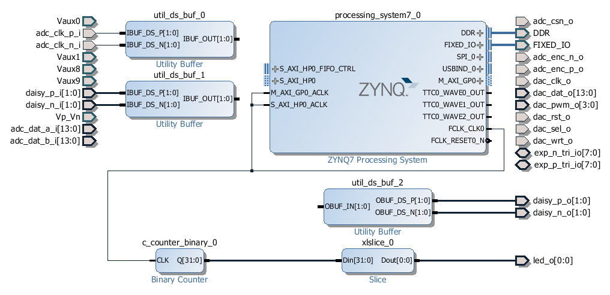
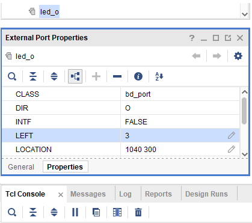
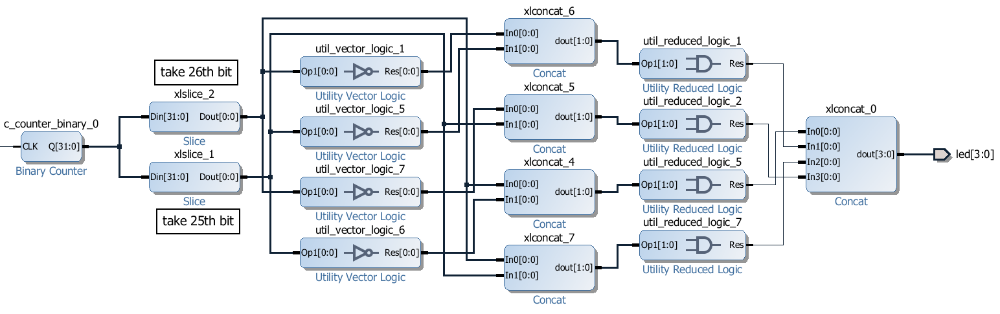

.. _ledblink:

##################
Simple LED blinker
##################

=============
Project setup
=============

* Windows 10 or Ubuntu 18.04
* Vivado 2020.1
* RepPitaya ecosystem project

Xilinx SDK is available from Xilinx downloads page:
https://www.xilinx.com/support/download/index.html/content/xilinx/en/downloadNav/vivado-design-tools/2020-1.html

Ecosystem:
https://github.com/RedPitaya/RedPitaya.git

To work with Vivado and its instruments in Windows we use TCL shell and Command prompt. Launch **Vivado HLS 2020.1 Command Prompt**
Change to the folder with cloned RedPitaya project and launch the project generation:

.. code-block:: shell-session

    cd C:/Users/RedPitaya/fpga
    vivado -source red_pitaya_vivado_project_Z10.tcl -tclargs v0.94

On Linux it will work via the terminal, however, to get access to some necessary commands you should execute settings64.sh (located in the Vivado folder). 
Then you can execute Vivado command. 

.. code-block:: shell-session

    /opt/Xilinx2/Vivado/2020.1/settings64.sh
    vivado -source red_pitaya_vivado_project_Z10.tcl -tclargs v0.94

When executing this command, the script will be launched and this script will generate a project for RedPitaya Z10 into the folder RedPitaya/fpga/prj/v0.94/project. 

============================================
Generation of an example from the repository
============================================

Now, we are ready to build our first project Led_blink. Open Vivado and in Vivado Tcl Console navigate to the base folder: **RedPitaya/fpga/prj/Examples.** 

.. figure:: img/LedBlink1.png
    :alt: Logo
    :align: center

Then run the script source make_project.tcl. Tools → Run Tcl Script

.. figure:: img/LedBlink2.png
    :alt: Logo
    :align: center

**make_project.tcl** automatically creates a full project in the **RedPitaya/fpga/prj/Examples/Led_blink/** folder. Take a moment to examine the Block Design. 
If it is not open click on **Open Block Design** on the left-hand side of the window. 
When you are ready click **Generate Bitstream** at the bottom-left part of the window to generate a bitstream file. 
After you confirm that both Synthesis and Implementation will be executed beforehand the longer process starts.When synthesis, implementation and bitstream generation are successfully finished the bit file can be found at **Examples/tmp/Led_blink/tmp/Led_blink.runs/impl_1/system_wrapper.bit**

Copy newly generated bit file to the RedPitaya’s /root/tmp folder using WinSCP or type the following commands in Linux console

.. code-block:: shell-session

    cd examples/tmp/Led_blink/Led_blink.runs/impl_1/
    scp system_wrapper.bit root@your_rp_ip:Led_blink.bit

Finally, we are ready to program the FPGA with our own bitstream file located in the **/root/** folder on Red Pitaya. 
To program the FPGA simply execute the following line in the Linux console on your Red Pitaya (use Putty):

.. code-block:: shell-session

    cat /root/Led_blink.bit > /dev/xdevcfg

Now, you should see the 0th LED blink. Don’t worry, you did not destroy your Red Pitaya. If you want to roll back to the official Red Pitaya FPGA program run

.. code-block:: shell-session

    cat /opt/redpitaya/fpga/fpga_X.XX.bit > /dev/xdevcfg

or simply restart Red Pitaya.

===========
Description
===========

Congratulations, you have just programmed your FPGA! But now, you are probably asking yourself what just happened? 
Let us quickly go though the most important steps to understand how we made one of the LEDs blink.

In this project we did not need to write any hardware description language (HDL) code. Instead we use IP cores which are a packaged code already available in Vivado and connect them in the IP Integrator. 
IP integrator (Block Design) is a useful addition to Vivado, which offers a visual representation of our program flow. 
It also helps us connect relevant blocks and navigate between our code. 
We will learn how to add our code as a block in the Block Design in the next project.

During the project creation the script specifies Red Pitaya’s FPGA part name *xc7z010clg400-1*. 
This information is important for synthesis, implementation and bitstream generation. 
Later, the script creates Red Pitaya specific external ports related to the chip pins as described in the constraint file shown in *Sources* tab under *Constraints/constrs_1/port.xdc (or Led_blink/cfg/port.xdc)*.

    
    Block Design of 1_led_blink project

Next, the script adds the Zynq *processing_system7* block with Red Pitaya specific settings set by *Led_blink/cfg/red_pitaya.xml*. 
This IP core represents an interface between the processing system used for running Linux and the programmable logic (FPGA). 
There are many useful shared ports such as a clock (FCLK_CLK0), and communication interface ports (M_AXI_GPIO) which we will use in the future projects. 
Quick introduction to *processing_system7* can be found on the `Xilinx’s video page <http://www.xilinx.com/video/soc/zynq-processing-system-highlights.html>`_.

Some of the external ports are differential and therefore need to be properly handled. 
For this reason the script adds three buffers with differential ports (IBUFDS type) and connects them to those external ports (adc_clk_*, 2 x dasy_*). 
These buffers play no role in our LED blinking algorithm but should be there for proper implementation.
To achieve LED blinking with an interval of around 1 s we use FCLK_CLK0 clock from the *processing_system7* block running at 125 MHz. 
To reduce the frequency from 125 MHz to 1 Hz we connect FCLK_CLK0 to 32-bit Binary Counter block and then to the Slice block which selects only 26th bit. 
The time interval of 26th bit is therefore

.. math::

    2 * 2^{26} / 125 MHz = 1.07 s.

The 26-th bit is finally wired to the led(0) which makes LED(0) blink on the Red Pitaya board. 
You can change the size of the *Binary Counter* or the *Slice* position by double clicking on the block and changing its parameters. 
The connections (wires) are simply made by clicking on a free port and dragging it another port or wire. 
IP Integrator will check port types and sizes and allow a connection only if these are compatible. 
Sometimes IP Integrator offers a *Run Block Automation* option on top of the *Block Design* area which can automatically connects ports and even adds additional blocks when needed. 
Further information on how to use Vivado’s IP Integrator (Block Design) can be found in Xilinx `documentation <http://www.xilinx.com/support/documentation/sw_manuals/xilinx2015_1/ug994-vivado-ip-subsystems.pdf>`_.

===========
Extension 1
===========

One can play and create more exciting blinking LEDs sequences. 
For fun try changing blocks responsible for blinking to the following diagram and see what happens. 
For this you can use a number of available Xilinx’s IP cores when right clicking on the empty space on the Block Design and choosing *Add IP…*. 
Don’t forget to change the *LEFT* attribute of the *led* port to 3.

===========
Extension 2
===========

Instead of connecting our periodic signal to the LED (*led_o[0]*) we can also connect it to an extension port *exp_tri_p_io[0]* linked with the *DIO0_p* pin on the extension connector E1. 
Since the *exp_tri_p_io* is bidirectional we cannot simply wire it in the block_design. 
There are two ways to solve this problem. (1) Delete the exp_tri_p_io port and create a new one with the same name and different direction. 
You can create the port by right-clicking on the block design area and select *Create Port…* or modify a tcl command found on line 38 in *cfg/port.tcl* file and execute it in the tcl console. (2) 
The second solution is much simpler. Use the following tcl command to connect your signal to the desired bidirectional port (*exp_tri_p_io*)

.. code-block:: tcl

    connect_bd_net [get_bd_pins xlconcat_0/In0] [get_bd_pins exp_p_tri_io]

We can check if the *DIO0_p* pin has a periodic signal by connecting it to the neighbouring pin *DIO0_n* on the E1 connector with an external wire. 
We can use the same technique to connect the corresponding *exp_tri_n_io[0]* port to the second LED in the block design. 
Check the :ref:`Extension connector’s <e1>` manual to locate appropriate pins. 
If all goes well, as soon as you connect *DIO0_p* and *DIO0_n* pins two LEDs should blink at the same time. Be careful when connecting any external signals to the E1 connector. 
Always check the voltage requirements first. 
The following schematics shows how to assemble the block design.

===========
Conclusion
===========

This concludes our first project. 
We have learned how to install Zynq FPGA Vivado development suite and created a simple project where we run the synthesis, the implementation and generated a bitstream file. 
We uploaded the bit-file to Red Pitaya’s Linux and used it to configure the programmable logic. 
Since here all Red-Pitaya specific components are present, *LED blinker* is an ideal starting point for more advanced projects.