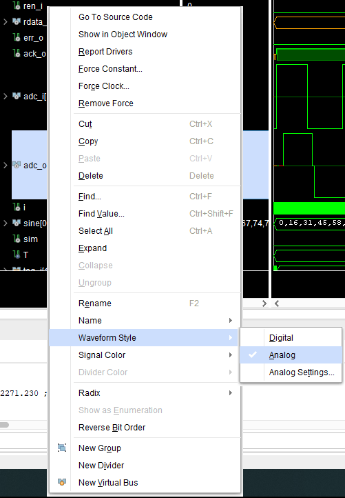

############################
Moving average on Red Pitaya
############################

On the Red Pitaya development board, we make a circuit for signal scaling and filtering with a small 
averaging sieve that calculates the average of four consecutive samples.

=============
Project setup
=============

* Windows 10 or Ubuntu 18.04
* Vivado 2020.1
* RepPitaya ecosystem project

Xilinx SDK is available from Xilinx downloads page:
https://www.xilinx.com/support/download/index.html/content/xilinx/en/downloadNav/vivado-design-tools/2020-1.html

Ecosystem:
https://github.com/RedPitaya/RedPitaya.git

To work with Vivado and its instruments in Windows we use TCL shell and Command prompt. Launch **Vivado HLS 2020.1 Command Prompt**
Change to the folder with cloned RedPitaya project and launch the project generation:

.. code-block:: shell-session

    cd C:/Users/RedPitaya/fpga
    vivado -source red_pitaya_vivado_project_Z10.tcl -tclargs v0.94

On Linux it will work via the terminal, however, to get access to some necessary commands you should execute settings64.sh (located in the Vivado folder). 
Then you can execute Vivado command. 

.. code-block:: shell-session

    /opt/Xilinx2/Vivado/2020.1/settings64.sh
    vivado -source red_pitaya_vivado_project_Z10.tcl -tclargs v0.94

When executing this command, the script will be launched and this script will generate a project for RedPitaya Z10 into the folder RedPitaya/fpga/prj/v0.94/project. 

============================================
Generation of an example from the repository
============================================

To launch an example from the repository you need to execute the following command:

.. code-block:: shell-session

    cd C:/Users/RedPitaya/fpga/prj/Examples/Simple_moving_average/
    vivado -source make_project.tcl

=========================
Creation of a new project
=========================

1) Create a folder in /RedPitaya/fpga/prj/Examples, for example, named "Simple Moving Average".
2) Copy all files from /RedPitaya/fpga/prj/v0.94 the newly created folder.
3) Create a file **red_pitaya_proc.vhd** in “Simple Moving Average/rtl”.
4) Copy the framework of filter development into the file. 

.. code-block:: vhdl

    library IEEE;
    use IEEE.STD_LOGIC_1164.all;
    use IEEE.NUMERIC_STD.all;

    entity red_pitaya_proc is  
    port (
        clk_i   : in  std_logic;                      -- bus clock 
        rstn_i  : in  std_logic;                      -- bus reset - active low
        addr_i  : in  std_logic_vector(31 downto 0);  -- bus address
        wdata_i : in  std_logic_vector(31 downto 0);  -- bus write data          
        wen_i   : in  std_logic;                      -- bus write enable
        ren_i   : in  std_logic;                      -- bus read enable
        rdata_o : out std_logic_vector(31 downto 0);  -- bus read data
        err_o   : out std_logic;                      -- bus error indicator
        ack_o   : out std_logic;                      -- bus acknowledge signal

        adc_i : in  std_logic_vector(13 downto 0);
        adc_o : out std_logic_vector(13 downto 0)
        );
    end red_pitaya_proc;

    architecture Behavioral of red_pitaya_proc is
        component moving_average
            port ( 
                data_i   : in std_logic_vector (13 downto 0);
                clk_i    : in std_logic;
                rstn_i   : in std_logic;                    
                tag_i    : in unsigned (1 downto 0);
                data_o   : out std_logic_vector (13 downto 0));
        end component;
    
    begin

    pbusr: process(clk_i)
    begin
        if(rising_edge(clk_i)) then
        if (wen_i or ren_i)='1' then
            ack_o <= '1';
        end if;   
        
        if (rstn_i = '0') then

        else
            case addr_i(19 downto 0) is
                when X"00000" => rdata_o <= X"00000001";
                
                when others => rdata_o <= X"00000000";
            end case;
        end if;
        end if;
    end process;

    end Behavioral;

Also, we will need to copy **red_pitaya_scope.v** from  "/RedPitaya/fpga/rtl/classic" to the folder “Simple Moving Average/rtl”.

Now create **red_pitaya_proc_tb.vhd** in "/Simple Moving Average/tbn" and copy the code there:

.. code-block:: vhdl

    library IEEE;
    use IEEE.STD_LOGIC_1164.all;
    use IEEE.numeric_std.all;

    entity red_pitaya_proc_tb is
    end red_pitaya_proc_tb;

    architecture Behavioral of red_pitaya_proc_tb is

    component red_pitaya_proc
        port (
        clk_i   : in  std_logic;
        rstn_i  : in  std_logic;
        addr_i  : in  std_logic_vector(31 downto 0);
        wdata_i : in  std_logic_vector(31 downto 0);
        wen_i   : in  std_logic;
        ren_i   : in  std_logic;
        rdata_o : out std_logic_vector(31 downto 0);
        err_o   : out std_logic;
        ack_o   : out std_logic;
        adc_i   : in  std_logic_vector(13 downto 0);
        adc_o   : out std_logic_vector(13 downto 0));
    end component;

    signal clk_i   : std_logic := '0';
    signal rstn_i  : std_logic;
    signal addr_i  : std_logic_vector(31 downto 0);
    signal wdata_i : std_logic_vector(31 downto 0);
    signal wen_i   : std_logic;
    signal ren_i   : std_logic;
    signal rdata_o : std_logic_vector(31 downto 0);
    signal err_o   : std_logic;
    signal ack_o   : std_logic;
    signal adc_i   : std_logic_vector(13 downto 0);
    signal adc_o   : std_logic_vector(13 downto 0);

    signal i : integer range 0 to 30 := 0;
    type memory_type is array (0 to 29) of integer range -128 to 127;
    signal sine : memory_type := (0, 16, 31, 45, 58, 67, 74, 77, 77, 74, 67, 58, 45, 31, 16, 0,
                                    -16, -31, -45, -58, -67, -74, -77, -77, -74, -67, -58, -45, -31, -16);

    -- Simulation control
    signal sim : std_logic := '0';

    constant T  : time := 50 ns;
    begin
    uut : red_pitaya_proc port map (
        clk_i   => clk_i,
        rstn_i  => rstn_i,
        addr_i  => addr_i,
        wdata_i => wdata_i,
        wen_i   => wen_i,
        ren_i   => ren_i,
        rdata_o => rdata_o,
        err_o   => err_o,
        ack_o   => ack_o,
        adc_i   => adc_i,
        adc_o   => adc_o);

    -- Define the clock
    clk_process : process
    begin
        if sim = '0' then
        clk_i <= '0';
        wait for T/2;
        clk_i <= '1';
        wait for T/2;
        else
        wait;
        end if;
    end process;

    -- Generate a sine signal from the table
    singen : process(clk_i)
    begin
        if(rising_edge(clk_i)) then
    --    adc_i <= std_logic_vector(to_signed(20*sine(i), 14));
        if (sine(i) > 0) then
            adc_i <= std_logic_vector(to_signed(2000, 14));
        else
            adc_i <= std_logic_vector(to_signed(-2000, 14));
        end if;
        i <= i + 1;
        if(i = 29) then
            i <= 0;
        end if;
        end if;
    end process;

    -- Sets the simplified AXI bus signals
    stim_proc : process
    begin
        rstn_i  <= '0';                     -- active reset
        addr_i  <= X"00000008";
        wdata_i <= X"00000000";
        wen_i   <= '0'; ren_i <= '0';

        wait for T;
        rstn_i  <= '1';  -- deactivate reset, write to register
        addr_i  <= X"00000008";
        wdata_i <= X"00000002";
        wen_i   <= '1';

        wait for T;
        wen_i <= '0';

        wait for 100*T;                      -- entry of a new value in the register
        wdata_i <= x"00000003";
        wen_i   <= '1';

        wait for T;
        addr_i  <= X"00000000";
        wen_i <= '0';

        wait for 100*T;
        sim <= '1';                         -- stop the simulation
        wait;
    end process;

    end;

Now we need to create a project generation script.
Create a copy of **red_pitaya_vivado_project_Z10.tcl** and name it, for example, **Average_project.tcl**.

We need to change some strings:

.. code-block:: tcl

    cd prj/$prj_name 			→ cd prj/Examples/$prj_name
    set path_brd ./../brd 		→ set path_brd ./../../brd
    set path_sdc ../../sdc 		→ set path_sdc ../../../sdc
    add_files  ../../$path_rtl 	→ add_files  ../../../$path_rtl

Add a variable

.. code-block:: tcl

    set path_tbn tbn

Also we need to add the following strings: 

.. code-block:: tcl

    update_files -from_files $path_rtl/red_pitaya_scope.v -to_files ../../../$path_rtl/classic/red_pitaya_scope.v -filesets [get_filesets *]
    add_files -fileset sim_1 -norecurse $path_tbn/red_pitaya_proc_tb.vhd

after the string

.. code-block:: tcl

    add_files $path_bd

Now we can generate a project:

.. code-block:: shell-session

    vivado -source Average_project.tcl -tclargs "Simple Moving Average"

If everything is done correctly, in the generated project we can generate bitstream without any errors.

Edit file **red_pitaya_top.sv**. 
Connect 2 additional signals to the oscilloscope module:

.. code-block:: verilog

    ////////////////////////////////////////////////////////////////////////////////
    // oscilloscope
    ////////////////////////////////////////////////////////////////////////////////

    logic trig_asg_out;
    logic  [14-1: 0] adc_i;
    logic  [14-1: 0] adc_o;

    red_pitaya_scope i_scope (
    // Simple Moving Average
    .adc_in        (adc_o       ),
    .adc_out       (adc_i       ),
    // ADC
    .adc_a_i       (adc_dat[0]  ),  // CH 1
    .adc_b_i       (adc_dat[1]  ),  // CH 2

Change the file red_pitaya_scope:

.. code-block:: verilog

    module red_pitaya_scope #(parameter RSZ = 14  // RAM size 2^RSZ
    )(
        // Simple Moving Average
        input      [ 14-1: 0] adc_in          ,  
        output     [ 14-1: 0] adc_out         ,
        // ADC
        input                 adc_clk_i       ,  // ADC clock
        input                 adc_rstn_i      ,  // ADC reset - active low

This one:

.. code-block:: verilog

    always @(posedge adc_clk_i) begin
        if (adc_we && adc_dv) begin
            adc_a_buf[adc_wp] <= adc_a_dat ;
            adc_b_buf[adc_wp] <= adc_b_dat ;
        end
    end

Needs to be substituted with that one:

.. code-block:: verilog

    // Simple Moving Average
    always @(posedge adc_clk_i) begin
        if (adc_we && adc_dv) begin
            adc_a_buf[adc_wp] <= adc_in ;
            adc_b_buf[adc_wp] <= adc_b_dat ;
        end
    end

    assign adc_out = adc_b_dat;

Then we need to connect signals to **red_pitaya_proc** in the file **red_pitaya_top.sv**:

.. code-block:: verilog

    // Simple Moving Average
    red_pitaya_proc i_proc (
        .clk_i    (  adc_clk     ),  // clock
        .rstn_i   (  adc_rstn    ),  // reset - active low  
        .addr_i   (  sys[6].addr ),  // address
        .wdata_i  (  sys[6].wdata),  // write data
        .wen_i    (  sys[6].wen  ),  // write enable
        .ren_i    (  sys[6].ren  ),  // read enable
        .rdata_o  (  sys[6].rdata),  // read data
        .err_o    (  sys[6].err  ),  // error indicator
        .ack_o    (  sys[6].ack  ),  // acknowledge signal
        .adc_i    (  adc_i       ),
        .adc_o    (  adc_o       )
    );

We need to remove the stub for the current bus:

.. code-block:: vhdl

    generate
    for (genvar i=7; i<8; i++) begin: for_sys
        sys_bus_stub sys_bus_stub_5_7 (sys[i]);
    end: for_sys
    endgenerate

=================================
Development of the moving average
=================================

Create a schema that calculates the current average of the last three inputs.
Basic outline of the moving average:

Connections:

* clk, reset (active at logical 0)
* data_i, 8-bit input
* tag_i, 2-bit control input
* data_o, 8-bit output
* tag_o, 2-bit control output

The data comes into the circuit one after the other, and the control input indicates the cycles in which the data is valid.
At tag_i = 01 the first data is at the input, at 10 they are the following, and at 11 the last data:

+-------+------+------+------+------+------+------+------+------+------+
| cycle | 1    | 2    | 3    | 4    | 5    | 6    | 7    | 8    | 9    |
+=======+======+======+======+======+======+======+======+======+======+
| tag_i | 00   | 01   | 10   | 10   | 10   | 10   | 11   | 00   | 00   |
+-------+------+------+------+------+------+------+------+------+------+
| data_i| xx   | 100  | 50   | 200  | 200  | 200  | 120  | xx   | xx   |
+-------+------+------+------+------+------+------+------+------+------+

The task of the circuit is to calculate the current average of the last three values. For the first valid data
assume that the previous two values are equal to 0.

The circuit contains 3 series-connected registers and a combinational circuit for calculating the average value after
equations: p = (a + b + c) * 1/3 ≈ ((a + b + c) * 85) >> 8

Instead of dividing by 3, we will use an approximation: ⅓ ≈ 85/256. Use a 7-bit constant 85 to multiply,
division by 256 represents the value shifted by 8 places to the right. The shift is made by selection
subvector, where the lower 8 bits of the product are removed.

In order to implement it, we should follow the steps:

* Create a file **moving_average.vhd** in "Simple Moving Average\rtl". 
* Define inputs and outputs:

.. code-block:: vhdl

    entity moving_average is
    Port ( data_i   : in std_logic_vector (13 downto 0);    -- adc input data
           clk_i    : in std_logic;                         -- bus clock 
           rstn_i   : in std_logic;                         -- bus reset - active low
           tag_i    : in unsigned (1 downto 0);             -- filter window size
           data_o   : out std_logic_vector (13 downto 0));  -- filtered data
    end moving_average;
    …

We will need some memory to store previous values. Describe the memory type and create it. Also, we will need some register to store the sum:

.. code-block:: vhdl

    architecture Behavioral of moving_average is
        type mem_t is array (0 to 2) of signed (13 downto 0);
    
        signal regs: mem_t; -- buffer for moving average algorithm
        signal sum: signed(13 downto 0); -- register for storing the sum of register values
    begin

Data is updated for each clk, thus, we will depend on them:

.. code-block:: vhdl

    process (clk_i)
    begin
        if(rising_edge(clk_i)) then

We need to reset registers:

.. code-block:: vhdl

    if (rstn_i = '0') then
        sum <= "00000000000000";

Connect the first register with ADC directly

.. code-block:: vhdl

    regs(0) <= signed(data_i);

The summer will always add constructively 3 registers:

.. code-block:: vhdl

    sum <= regs(0) + regs(1) + regs(2)

Then we should describe connection among registers. We should keep in mind that the summer adds constructively 3 registers. 
Thus, we need to reset register values to 0 so that the moving average is calculated correctly. 

.. code-block:: vhdl

    if (tag_i(1) = '1') then
        regs(1) <= regs(0);
    else
        regs(1) <= "00000000000000";
    end if;
            
    if (tag_i(0) = '1') then
        regs(2) <= regs(1);
    else
        regs(2) <= "00000000000000";
    end if;

The last thing we need is the multiplexer to calculate an average value for buffer of different length. Since division is a pretty complex procedure, we need to simplify it. 
One of the approaches is a real number with a fixed point. We can represent a division as 13 85256. Division by 256 is executed by a simple operation of right logical shift. 

.. code-block:: vhdl

    case tag_i is
        -- regs
        when "01" => data_o <= std_logic_vector(sum);
                
        -- regs / 2
        when "10" => data_o <= std_logic_vector(shift_right(sum, 1));
                
        -- (regs * 85) / 256
        when "11" => data_o <= std_logic_vector(resize(shift_right(sum * 85, 8), 14));
                     
        -- (regs * 85) / 256
        when others => data_o <= std_logic_vector(resize(shift_right(sum * 85, 8), 14));
    end case;

The code of the module:

.. code-block:: vhdl

    library IEEE;
    use IEEE.STD_LOGIC_1164.ALL;
    use IEEE.NUMERIC_STD.all;

    entity moving_average is
        Port ( data_i   : in std_logic_vector (13 downto 0);    -- 
            clk_i    : in std_logic;                         -- bus clock 
            rstn_i   : in std_logic;                         -- bus reset - active low
            tag_i    : in unsigned (1 downto 0);             -- 
            data_o   : out std_logic_vector (13 downto 0));  -- 
    end moving_average;

    architecture Behavioral of moving_average is
        type mem_t is array (0 to 2) of signed (13 downto 0);
        
        signal regs: mem_t; -- buffer for moving average algorithm
        signal sum: signed(13 downto 0);
    begin

    regs(0) <= signed(data_i);

    process (clk_i)
    begin
        if(rising_edge(clk_i)) then
            if (rstn_i = '0') then
                sum <= "00000000000000";
            else            
                case tag_i is
                    -- regs
                    when "01" => data_o <= std_logic_vector(sum);
                    
                    -- regs / 2
                    when "10" => data_o <= std_logic_vector(shift_right(sum, 1));
                    
                    -- (regs * 85) / 256
                    when "11" => data_o <= std_logic_vector(resize(shift_right(sum * 85, 8), 14));
                        
                    -- (regs * 85) / 256
                    when others => data_o <= std_logic_vector(resize(shift_right(sum * 85, 8), 14));
                end case;
                
                if (tag_i(1) = '1') then
                    regs(1) <= regs(0);
                else
                    regs(1) <= "00000000000000";
                end if;
                
                if (tag_i(0) = '1') then
                    regs(2) <= regs(1);
                else
                    regs(2) <= "00000000000000";
                end if;
                            
                sum <= regs(0) + regs(1) + regs(2);
            end if;
        end if;
    end process;

    end Behavioral;

We need to add this module to **red_pitaya_proc**

.. code-block:: vhdl

    rp_average: 
        moving_average 
            port map (
                data_i => adc_i,
                clk_i => clk_i,
                rstn_i => rstn_i,
                tag_i => tag_i,
                data_o => adc_o
            );

Create a register to store the moving average of a chosen length:

.. code-block:: vhdl

    signal tag_i: unsigned(1 downto 0) := "01";

Define the value after reset:

.. code-block:: vhdl

    if (rstn_i = '0') then
        tag_i <= "01";
    else

====================
Work with registers
====================

In order to change the buffer dimension we need to have the “write” right into this register by the address. 
Module red_pitaya_proc is already connected with the system bus and has the following address: 0x406xxxxx. 
We need to write in tag_i register upon receiving data by the address. 

.. code-block:: vhdl

    case addr_i(19 downto 0) is
        when X"00000" => rdata_o <= X"000001";
        when X"00008" => tag_i <= unsigned(wdata_i(1 downto 0));
        when others => rdata_o <= X"000000";
    end case;

You can find more details about the redpitaya register map :doc:`here </developerGuide/fpga>`

Device enquiry and their configuration is made by 0x40600000, thus, we’re using 0x40600008.

==========
Simulation
==========

Define **red_pitaya_proc_tb.vhd** as the upper module

Launch simulation and setup signals adc_i и adc_o as analog:

Setup data type of signal:

Setup the display of these signals:

.. image:: img/diag5.png

After the simulation is done, you should see the following oscillogram:

.. image:: img/diag7.png

We can notice that the signal has got corrupted when we change the size of tag_i (about 5us on the oscillogram). It’s caused by the fact that when we increase the size of tag_i, one or two registers become empty and the signal amplitude falls down. 

You can comment rectangle generation and uncomment sine generation to see how this filter handles a sinewave:

.. code-block:: vhdl

    -- Generate a sine signal from the table
    singen : process(clk_i)
    begin
        if(rising_edge(clk_i)) then
        adc_i <= std_logic_vector(to_signed(20*sine(i), 14));
    --      if (sine(i) > 0) then
    --        adc_i <= std_logic_vector(to_signed(2000, 14));
    --      else
    --        adc_i <= std_logic_vector(to_signed(-2000, 14));
    --      end if;
        i     <= i+ 1;
        if(i = 29) then
            i <= 0;
        end if;
        end if;
    end process;

==============================
Upload bitstream to redpitaya
==============================

Enter SD card with the uploaded STEMlab and move to folder D:/fpga, copy the bitstream there. 
Upon launching the oscilloscope we need to move to D:/www/apps/scopegenpro and define the path to our bitstream in the file fpga.conf 

.. code-block:: shell-session

    /opt/redpitaya/fpga/red_pitaya_top.bit

=======
Testing
=======

Connect to red pitaya and start oscilloscope. 
In order to setup the filter, we need to connect via SSH and enter the following command:

.. code-block:: shell-session
    
    monitor 0x40600008 3

where 0x40600008 is the address of our register
3 is the value which should be written in the register.

The result of our filter working when the register value equals 3:

The result of our filter working when the register value equals 2:

The result of our filter working when the register value equals 1:

