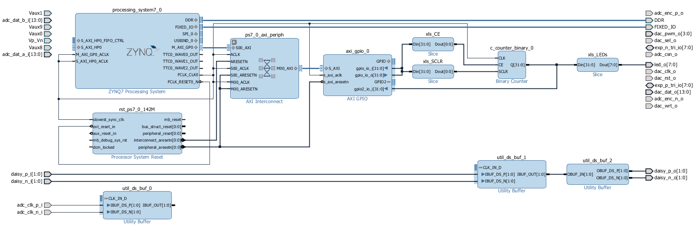
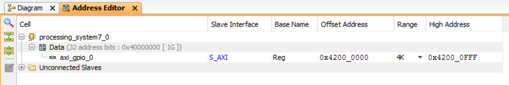
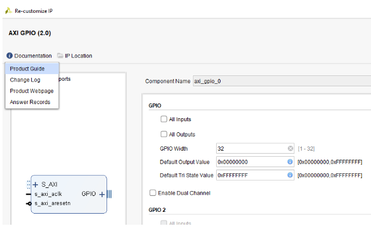

.. _stopwatch:

#########
Stopwatch
#########

=============
Project setup
=============

* Windows 10 or Ubuntu 18.04
* Vivado 2020.1
* RepPitaya ecosystem project

Xilinx SDK is available from Xilinx downloads page:
https://www.xilinx.com/support/download/index.html/content/xilinx/en/downloadNav/vivado-design-tools/2020-1.html

Ecosystem:
https://github.com/RedPitaya/RedPitaya.git

To work with Vivado and its instruments in Windows we use TCL shell and Command prompt. Launch **Vivado HLS 2020.1 Command Prompt**
Change to the folder with cloned RedPitaya project and launch the project generation:

.. code-block:: shell-session

    cd C:/Users/RedPitaya/fpga
    vivado -source red_pitaya_vivado_project_Z10.tcl -tclargs v0.94

On Linux it will work via the terminal, however, to get access to some necessary commands you should execute settings64.sh (located in the Vivado folder). 
Then you can execute Vivado command. 

.. code-block:: shell-session

    /opt/Xilinx2/Vivado/2020.1/settings64.sh
    vivado -source red_pitaya_vivado_project_Z10.tcl -tclargs v0.94

When executing this command, the script will be launched and this script will generate a project for RedPitaya Z10 into the folder RedPitaya/fpga/prj/v0.94/project. 

============================================
Generation of an example from the repository
============================================

Move to folder RedPitaya/fpga/prj/Examples. Uncomment the line *"set project_name Stopwatch"* and comment all files in the **make_project.tcl** file. Open Vivado and in Vivado Tcl Console navigate to the base folder: **RedPitaya\fpga\prj\Examples.** 

.. figure:: img/LedBlink1.png
    :alt: Logo
    :align: center

Then run the script source make_project.tcl. Tools → Run Tcl Script

.. figure:: img/LedBlink2.png
    :alt: Logo
    :align: center

**make_project.tcl** automatically creates a full project in the **RedPitaya/fpga/prj/Examples/Stopwatch/** folder. Take a moment to examine the Block Design. 
If it is not open click on **Open Block Design** on the left-hand side of the window. 
When you are ready click **Generate Bitstream** at the bottom-left part of the window to generate a bitstream file. 
After you confirm that both Synthesis and Implementation will be executed beforehand the longer process starts.When synthesis, implementation and bitstream generation are successfully finished the bit file can be found at **Examples/tmp/Stopwatch/tmp/Stopwatch.runs/impl_1/system_wrapper.bit**

Copy newly generated bit file to the RedPitaya’s /root/tmp folder using WinSCP or type the following commands in Linux console

.. code-block:: shell-session

    cd examples/tmp/Stopwatch/Stopwatch.runs/impl_1/
    scp system_wrapper.bit root@your_rp_ip:Stopwatch.bit

Finally, we are ready to program the FPGA with our own bitstream file located in the **/root/** folder on Red Pitaya. 
To program the FPGA simply execute the following line in the Linux console on your Red Pitaya (use Putty):

.. code-block:: shell-session

    cat /root/Stopwatch.bit > /dev/xdevcfg

If you want to roll back to the official Red Pitaya FPGA program run

.. code-block:: shell-session

    cat /opt/redpitaya/fpga/fpga_X.XX.bit > /dev/xdevcfg

or simply restart Red Pitaya.

============
Introduction
============

In this Red Pitaya FPGA project we will learn about communication between the Linux processing system and the programmable logic. 
We will demonstrate the basic functionality with a simple FPGA project – Stopwatch.

The FPGA algorithm will be based on a 32-bit binary counter with Clock Enable (CE) and Synchronous Clear (SCLR) inputs which we will control from the Linux side. 
he counter’s output value we will be read with a Linux program and partially displayed with the on-board LEDs. 
In order to do this we will use standard AXI communication protocol that connects different parts on the Zynq device such as processing system, programmable logic, DDR memory, external peripherals and more.

This guide assumes that you are familiar with the concepts introduced in the previous examples.

==============
Verilog Module
==============

Open one of the previous Vivado projects to get a basic block diagram. 
Next, insert the binary counter, if it is not already present, and add CE and SCLR ports. 
This can be done by double-clicking on the binary counter IP core in our block design and select CE and SCLR under the Control tab. 
Then add *xlslice* IP block with *Din Width: 32, Din From: 31, Din Down To: 24*. 
Connect CLK pin of the binary counter to PS’s *FCLK_CLK0*, output of the binary counter to the input of the xlslice and output of the xlslice to led_o external port. 
This last part will display 8 MSBs of the 32-bit counter on Red Pitaya’s LED bar. 
If you started from Project 1 change the LEFT property of *led_o* port from 0 to 7.

We are ready to insert AXI General Purpose IO IP core (*AXI GPIO*) to our block design. 
When the core is added, double-click on the block, check *Enable Dual Channel* and set *All Inputs* for the GPIO 2. 
To connect the AXI GPIO to the processing system click on *Run Connection Automation* on top of the block design. 
Select *S_AXI* and click OK. This will automatically create AXI Interconnect and Processor System Reset blocks. 
Next, add two xlslice IP cores with 32-bit Din. *xls_CE* should have *Din From* and *Din Down* To both set to 0 and *xls_SCLR* should have them both set to 1. 
Connect all the blocks as shown in the figure below.

    
    Block Design

Next, we need to set the AXI GPIO core’s memory address and range. 
We will use this address later to access the IP core from the Linux side. 
On top of the window choose Address Editor tab and set all the values as shown below. 
Remember the address of our GPIO block is 0x4200_0000.

The FPGA program is ready. Proceed with synthesis, implementation and generate the bitstream file. 
When the file is generated and copied to a folder on Red Pitaya’s Linux write the bitstream file to programmable logic with the following command

.. code-block:: shell-session

    cat system_wrapper.bit > /dev/xdevcfg

To write or read from our FPGA program we will use Red Pitaya’s :ref:`monitor tool <monitor_tool>` available in the Red Pitaya’s Linux. Try the following commands.

.. code-block:: shell-session

    monitor 0x42000000 1  # write: start, SCLR = 0, CE = 1
    monitor 0x42000000 0  # write: stop,  SCLR = 0, CE = 0
    monitor 0x42000000 2  # write: clear, SCLR = 1, CE = 0
    
    monitor 0x42000000	# read: cfg  on GPIO1
    monitor 0x42000008	# read: data on GPIO2

Great, we have created a stopwatch with a resolution of 8 ns! 
Using AXI communication protocol we can easily access our GPIO IP core. 
More details about the GPIO core can be found in the `here <https://www.xilinx.com/support/documentation/ip_documentation/axi_ref_guide/latest/ug1037-vivado-axi-reference-guide.pdf>`_ .
If you would like to know how much time has passed between start and stop in seconds and not in the number of clock cycles, you can use the following program on Linux to write, read and convert data. 
This program, based on `Pavel Demin’s code <http://pavel-demin.github.io/red-pitaya-notes/>`_, can also be a useful template for more advanced applications where you need to set several parameters and read large amount of data generated on FPGA.

stopwatch.c:

.. code-block:: c

    #include <stdio.h>
    #include <stdint.h>
    #include <unistd.h>
    #include <sys/mman.h>
    #include <fcntl.h>
    #include <stdlib.h>
    
    int main(int argc, char **argv)
    {
    int fd;
    float wait_time;
    uint32_t count;
    void *cfg;
    char *name = "/dev/mem";
    const int freq = 124998750; // Hz
    
    if (argc == 2) wait_time = atof(argv[1]);
    else wait_time = 1.0;
    
    if((fd = open(name, O_RDWR)) < 0) {
        perror("open");
        return 1;
    }
    cfg = mmap(NULL, sysconf(_SC_PAGESIZE), /* map the memory */
                PROT_READ|PROT_WRITE, MAP_SHARED, fd, 0x42000000);
    
    *((uint32_t *)(cfg + 0)) = 2;   // clear timer
    *((uint32_t *)(cfg + 0)) = 1;   // start timer
    
    sleep(wait_time);   // wait for [wait_time] seconds
    
    *((uint32_t *)(cfg + 0)) = 0;   // stop timer
    
    count = *((uint32_t *)(cfg + 8)); // get binary counter output
    
    printf("Clock count: %5d, calculated time: %5f s\n",
            count, (double)count/freq);
    
    munmap(cfg, sysconf(_SC_PAGESIZE));
    return 0;
    }

stopwatch.c program maps the memory at a given address to *cfg* pointer. 
By writing an appropriate 32-bit value to this pointer the code first clears the counter by setting SCLR (2nd bit), then starts the count by setting CE (1st bit). 
After *wait_time* in seconds the program stops the counter by clearing the CE bit. 
To read counter’s output value we need to access the second port of the GPIO IP core. According to GPIO documentation:

The address of the second port is shifted by 8 (0x4200_0008). At the end the counter output value is scaled by the *FCLK_CLK0* frequency and printed on the screen.

Compile and execute the program as shown here:

.. code-block:: shell-session

    gcc -o stopwatch stopwatch.c
    ./stopwatch 5   # wait for 5 s

Interestingly, *FCLK_CLK0* has a frequency of 124.99875 MHz (= 3.75*33.333 MHz). 
This is a default Red Pitaya frequency generated by IO PLL using 33.333 MHz external clock (PS_CLK). 
To increase the frequency to, for example, 143 MHz use the bash script mentioned by Jean in the comments.

==========
Conclusion
==========

We have created another simple project where we learned how to communicate between our FPGA program and Linux running on Red Pitaya’s Zynq7 ARM processor.