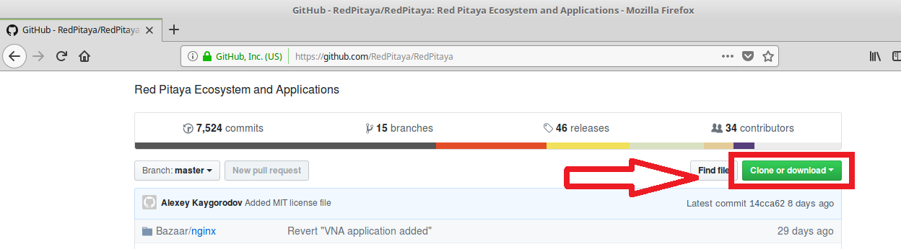
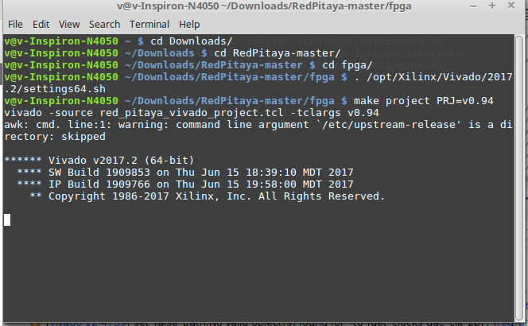
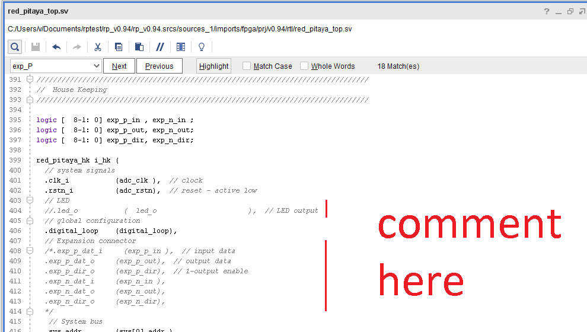
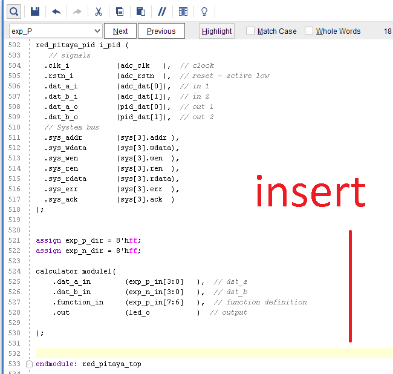

#################
Simple Calculator
#################

This example will show how to build a calculator. We will use the **case** statement and a implement a new module called calculator. We will use wires to connect the 3.3 V of redpitaya to change the values of the inputs. You will need to build a raw project of red pitaya Github, in the way of the "led blink" example. The project is the v.094.

Hardware required
=================
		
One redpitaya, a protoboard and wires.

Steps
=====

Clone FPGA GitHub repository
----------------------------

Go to the `Red Pitaya GitHub <https://github.com/RedPitaya/RedPitaya>`_ site, and download the ZIP folder of this project.
 

Make a FPGA project
-------------------

Go to the downloaded ZIP location and extract it. You will enter the fpga folder and make a Vivado project. Open a Terminal and input the following commands.

.. code-block:: bash

    cd Downloads/
    cd RedPitaya-master/
    cd fpga/
    . /opt/Xilinx/Vivado/2017.2/settings64.sh
    make project PRJ=v0.94

Create a source file
--------------------

In Vivado create a source file. Click on the "+" button on "Sources" window. Insert the name of the file as "calculator" and choose "System Verilog". Click Finish you will put the inputs and outputs later. Go to the file "calculator.sv" created and insert this code.

.. code-block:: Verilog

    module calculator (
    input logic [3:0] dat_a_in,
    input logic [3:0] dat_b_in,
    input logic [1:0] function_in,
    output logic [7:0] out
    );
    
    reg [7:0] out_sum, out_sub , out_mult, out_div;
    
    assign out = out_sum | out_sub | out_mult | out_div;
    
    always@(dat_a_in or dat_b_in)
    begin
        case (function_in)
        
            2'b00: begin
                out_sum <= dat_a_in + dat_b_in;           
                out_sub <= 7'b0;
                out_mult <= 7'b0;
                out_div <= 7'b0;
             end
            2'b01: begin 
                out_sub <= dat_a_in - dat_b_in;
                out_sum <= 7'b0;
                out_mult <= 7'b0;
                out_div <= 7'b0;
            
            end
            2'b10: begin 
                out_mult <= dat_a_in * dat_b_in;
                out_sum <= 7'b0;
                out_sub <= 7'b0;
                out_div <= 7'b0;
            end
            default: begin 
                out_div <= dat_a_in / dat_b_in;
                out_sum <= 7'b0;
                out_sub <= 7'b0;
                out_mult <= 7'b0;
            end
            
        endcase
    end
    endmodule

Edit top file
-------------

You will have to edit the **red_pitaya_top.sv** file. Comment led and exp part as in the image.

Now insert this code in "red_pitaya_top.sv" .

 .. code-block:: Verilog

    assign exp_p_dir = 8'hff;
    assign exp_n_dir = 8'hff;

    calculator module1(
        .dat_a_in        (exp_p_in[3:0]   ),  // dat_a
        .dat_b_in        (exp_n_in[3:0]   ),  // dat_b
        .function_in     (exp_p_in[7:6]   ),  // function definition
        .out             (led_o           )  // output
        );

Exp_p_dir and exp_n_dir are the direction of the expansion connector. One means it is an input and zero an output. The next part of the code is the instantiation of the calculator module.

Finally start synthesis, implementation and write bitstream. Send the bitstream file to redpitaya and program the FPGA. 

Usage
=====

To use the calculator connect the 3.3 V to the expansion connector inputs with wires, use a protoboard. 

Exp_p from 0 to 3 is the 4 bit input word A. Exp_n from 0 to 3 is the 4 bit input word B. To select the word connect the one bits to the 3.3 V. The 8 bits output is shown in the leds.

The 2 bits in exp_p 7 and 6 are used to choose the function. 00 is the sum, 01 is the subtraction, 10 is the multiplication and 11 is the division. Try multiplication by two and dividing by two and you will see the leds rotate. 

Negative numbers are represented by two complement.
